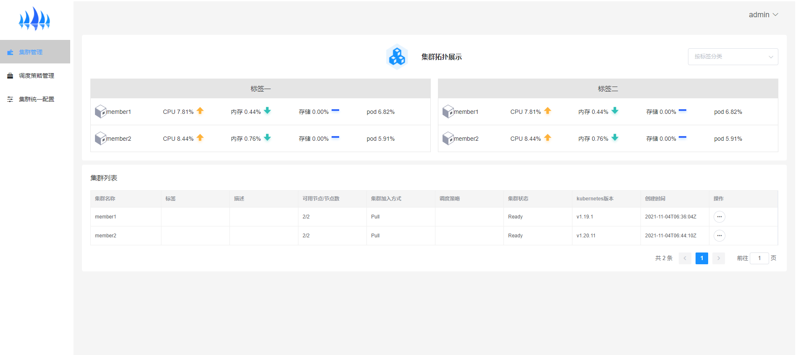
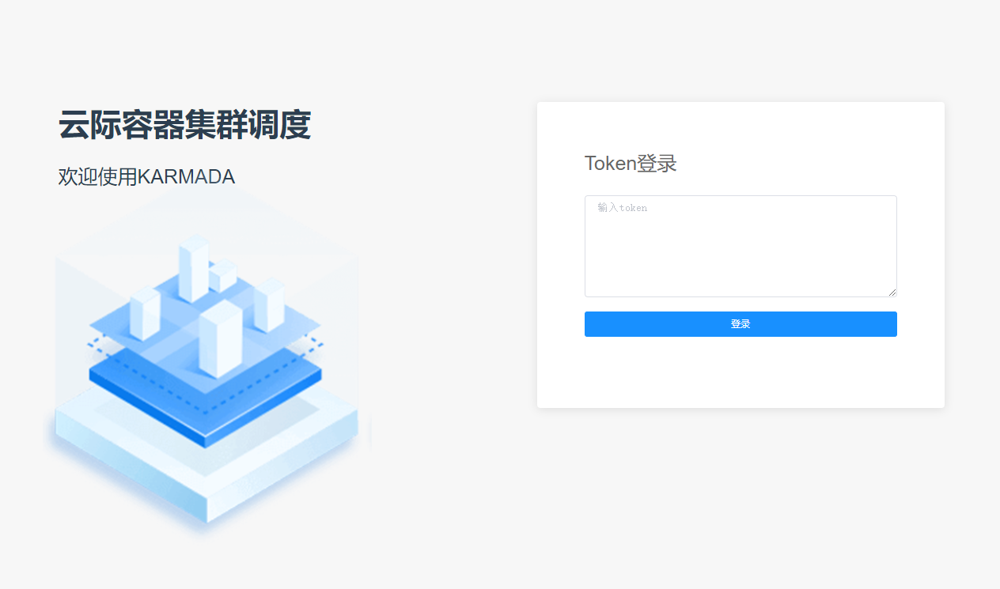

# KARMADA-DASHBOARD
Karmada Dashboard is a general purpose, web-based UI for Karmada which is a multi-cluster management project.


## QuickStart


### Prerequisites


#### Node
The current version of Karmada-dashboard requires node with version >= 8,recommended version is 8.17.0

---
### Install Karmada-dashboard


#### install dependencies 

```
npm install
```

#### compile project

```
npm run dev
```

#### build project

```
npm run build
```
#### login dashboard with the token generated in [Creating sample user](docs/creating-sample-user.md)


---

#### catalog of project

```
├── dist 
├── node_modules 
├── src 
│   ├── api 
│   ├── assets 
│   ├── components 
│   ├── mixin 
│   ├── router 
│   ├── store 
│   ├── styles
│   ├── utils 
│   ├── views 
├── app.vue 
├── main.js 
├── .env.xxx 
├── .eslintrc.js 
├── .gitignore 
├── babel.config.js 
├── package-lock.json 
├── package.json 
├── README.md 
├── vue.config.js 
```
