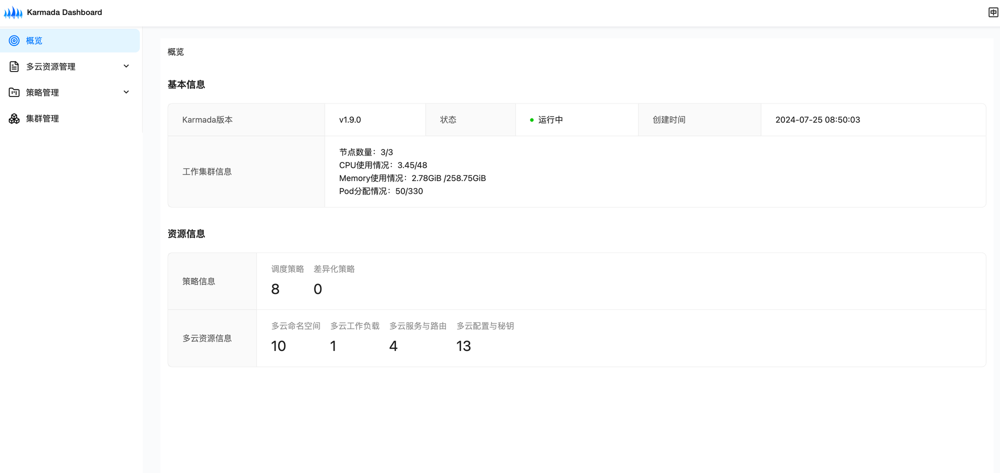
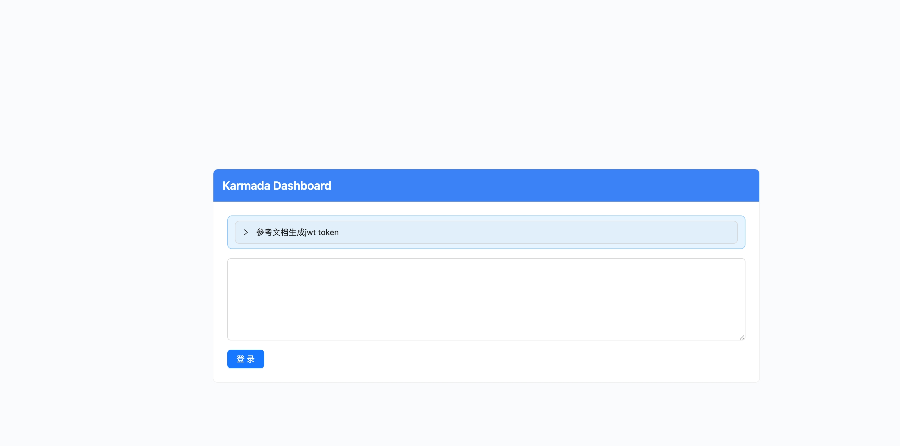

# Karmada-dashboard

[](https://github.com/kubernetes/dashboard/blob/master/LICENSE)
[](https://deepwiki.com/HappyLadySauce/dashboard)

Karmada Dashboard是Karmada的通用型基于Web的控制面板，Karmada是一个多集群管理项目。


## 🚀快速开始

### 前提条件

您需要在Kubernetes（即`宿主集群`）上安装Karmada，并且[karmadactl](https://karmada.io/docs/installation/install-cli-tools#install-karmadactl)或
kubectl命令行工具必须配置为能够与您的宿主集群和Karmada控制平面进行通信。

如果您还没有安装Karmada，可以按照这个[教程](https://karmada.io/docs/installation/#install-karmada-for-development-environment)来启动一个。

---

### 安装Karmada-dashboard

在以下步骤中是使用kind搭建的一个集群，我们将在运行Karmada控制平面组件的`宿主集群`上安装Karmada Dashboard。我们假设Karmada已安装在命名空间`karmada-system`中，
且Karmada配置位于`$HOME/.kube/karmada.config`，如果这与您的环境不同，请相应地修改以下命令。

1. 将您的Karmada配置的用户上下文切换到`karmada-host`。

```bash
export KUBECONFIG="$HOME/.kube/karmada.config"
kubectl config use-context karmada-host
```

`karmada-host`是karmada宿主机的`kubeconfig`，如果你是生产环境中的项目，可以直接使用宿主机的 `$HOME/.kube/config`。

```bash
export KUBECONFIG="$HOME/.kube/karmada.config"
```

现在，您应该能够通过以下命令查看Karmada控制平面组件：

```bash
kubectl get deployments.apps -n karmada-system
```

如果一切正常，您将得到类似于以下的消息：

```bash
NAME                                  READY   UP-TO-DATE   AVAILABLE   AGE
karmada-aggregated-apiserver          2/2     2            2           3d
karmada-apiserver                     1/1     1            1           3d
karmada-controller-manager            1/1     1            1           3d
karmada-kube-controller-manager       1/1     1            1           3d
karmada-scheduler                     2/2     2            2           3d
karmada-webhook                       2/2     2            2           3d
```

2. 部署Karmada Dashboard

将此仓库克隆到您的机器上：

```bash
git clone https://github.com/HappyLadySauce/dashboard.git
```

切换到dashboard目录：

```bash
cd dashboard
```

根据您的Karmada配置创建密钥，Karmada Dashboard将使用此配置与Karmada API服务器通信。

```bash
kubectl create secret generic kubeconfig --from-file=kubeconfig=$HOME/.kube/karmada.config -n karmada-system
```

部署Karmada Dashboard：

```bash
kubectl apply -k artifacts/overlays/nodeport-mode
```

这将在`karmada-system`命名空间中部署两个组件：

```bash
kubectl get deployments.apps -n karmada-system                                                                                                                karmada-dev-linux-renhongcai: Fri Jan 10 16:08:38 2025

NAME                                  READY   UP-TO-DATE   AVAILABLE   AGE
karmada-dashboard-api                 1/1     1            1           2m
karmada-dashboard-web                 1/1     1            1           2m
...
```

然后，您将能够通过`http://your-karmada-host:32000`访问Karmada Dashboard。
注意，Karmada Dashboard服务类型是`NodePort`，这会在您的`宿主集群`的每个节点上的特定端口上暴露dashboard，
使您能够通过任何节点的IP地址和该端口来访问它。

您也可以使用`kubectl port-forward`将本地端口转发到Dashboard的后端pod：

```bash
kubectl port-forward -n karmada-system services/karmada-dashboard-web --address 0.0.0.0 8000:8000
```

然后您可以通过`http://localhost:8000`访问它。

您仍然需要JWT令牌来登录dashboard。

3. 创建服务账户

如果你是生产环境中的项目，需要切换到karmada控制平面

```bash
export KUBECONFIG=/etc/karmada/karmada-apiserver.config
```

将用户上下文切换到karmada-apiserver：

```bash
kubectl config use-context karmada-apiserver
```

创建服务账户：

```bash
kubectl apply -f artifacts/dashboard/karmada-dashboard-sa.yaml
```

4. 获取JWT令牌

执行以下代码来获取JWT令牌：

```bash
kubectl -n karmada-system get secret/karmada-dashboard-secret -o go-template="{{.data.token | base64decode}}" && echo
```

它应该打印出类似这样的结果：

```bash
eyJhbGciOiJSUzI1NiIsImtpZCI6InZLdkRNclVZSFB6SUVXczBIRm8zMDBxOHFOanQxbWU4WUk1VVVpUzZwMG8ifQ.eyJpc3MiOiJrdWJlcm5ldGVzL3NlcnZpY2VhY2NvdW50Iiwia3ViZXJuZXRlcy5pby9zZXJ2aWNlYWNjb3VudC9uYW1lc3BhY2UiOiJrYXJtYWRhLXN5c3RlbSIsImt1YmVybmV0ZXMuaW8vc2VydmljZWFjY291bnQvc2VjcmV0Lm5hbWUiOiJrYXJtYWRhLWRhc2hib2FyZC10b2tlbi14NnhzcCIsImt1YmVybmV0ZXMuaW8vc2VydmljZWFjY291bnQvc2VydmljZS1hY2NvdW50Lm5hbWUiOiJrYXJtYWRhLWRhc2hib2FyZCIsImt1YmVybmV0ZXMuaW8vc2VydmljZWFjY291bnQvc2VydmljZS1hY2NvdW50LnVpZCI6ImE5Y2RkZDc3LTkyOWYtNGM0MS1iZDY4LWIzYWVhY2E0NGJiYiIsInN1YiI6InN5c3RlbTpzZXJ2aWNlYWNjb3VudDprYXJtYWRhLXN5c3RlbTprYXJtYWRhLWRhc2hib2FyZCJ9.F0BqSxl0GVGvJZ_WNwcEFtChE7joMdIPGhv8--eN22AFTX34IzJ_2akjZcWQ63mbgr1mVY4WjYdl7KRS6w4fEQpqWkWx2Dfp3pylIcMslYRrUPirHE2YN13JDxvjtYyhBVPlbYHSj7y0rvxtfTr7iFaVRMFFiUbC3kVKNhuZtgk_tBHg4UDCQQKFALGc8xndU5nz-BF1gHgzEfLcf9Zyvxj1xLy9mEkLotZjIcnZhwiHKFYtjvCnGXxGyrTvQ5rgilAxBKv0TcmjQep_TG_Q5M9r0u8wmxhDnYd2a7wsJ3P3OnDw7smk6ikY8UzMxVoEPG7XoRcmNqhhAEutvcJoyw
```

### 登录Dashboard

现在使用URL [http://your-karmada-host:32000]() 打开Karmada-dashboard

复制您刚刚生成的令牌并将其粘贴到登录页面上的输入令牌字段中。

一旦认证过程通过，您就可以自由使用karmada dashboard了。您可以按照karmada-dashboard的使用指南快速体验karmada dashboard。

## 会议

Dashboard定期会议：

* 周三14:30（UTC+8）（中文）（双周）。[转换为您的时区](https://www.thetimezoneconverter.com/?t=14%3A30&tz=GMT%2B8&)。
* 目前还没有专门的英文会议。如果您有任何话题要讨论，请加入[社区会议](https://github.com/karmada-io/karmada?tab=readme-ov-file#meeting)。

资源：
- [会议记录和议程](https://docs.google.com/document/d/1dX3skCE-QRBWzABq3O9cG7yhIDUWLYWmg7kGq8UHU6s/edit)
- [会议日历](https://calendar.google.com/calendar/embed?src=a71aae8a75e3558a90683596c71382b8195bf7c84cb50e6e75d1a3e64e08480b%40group.calendar.google.com&ctz=Asia%2FShanghai) | [订阅](https://calendar.google.com/calendar/u/1?cid=YTcxYWFlOGE3NWUzNTU4YTkwNjgzNTk2YzcxMzgyYjgxOTViZjdjODRjYjUwZTZlNzVkMWEzZTY0ZTA4NDgwYkBncm91cC5jYWxlbmRhci5nb29nbGUuY29t)
- [会议链接](https://zoom.us/j/97070047574?pwd=lXha0Sqngw4mwtmArP1sjsLMMXk34z.1)

## 💻贡献

Karmada dashboard仍在追赶Karmada的功能，目前我们只实现了基本的功能。
如果您想为Karmada dashboard的开发做出贡献，可以参考开发文档，我们很高兴看到更多的贡献者加入我们。
请随时向我们的仓库提交问题或拉取请求。

## 许可证

Karmada-dashboard采用Apache 2.0许可证。详情请参见[LICENSE](LICENSE)文件。
