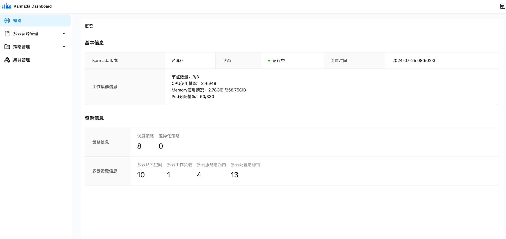
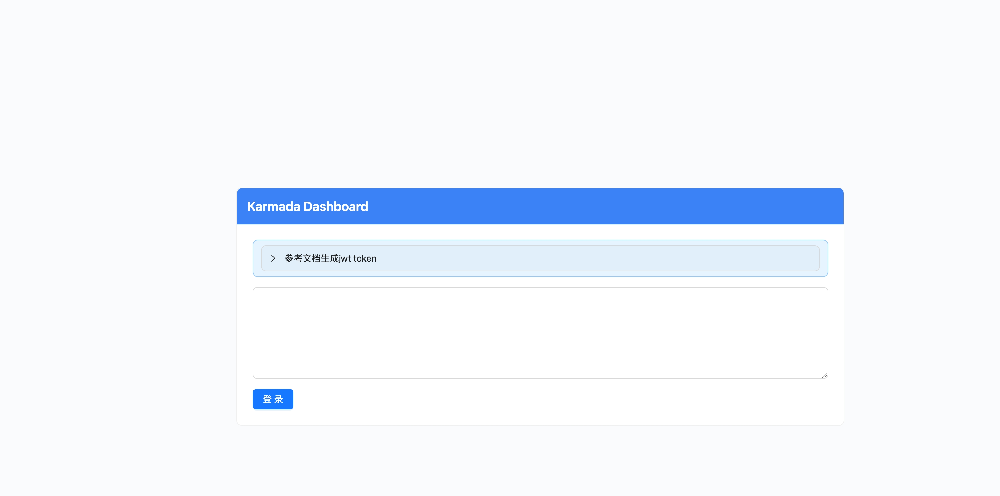

# Karmada-dashboard
[](https://github.com/kubernetes/dashboard/blob/master/LICENSE)

[English version](README.md)|中文版

Karmada是一个多云多集群管理的项目，Karmada Dashboard 是一个通用的、基于web的，可以用来管理 Karmada 的后台管理系统。


## 🚀快速开始

### Prerequisites
你需要在Kubernetes上安装Karmada（下文中称之为`host cluster`），并且必须配置karmadactl或kubectl命令行工具，并且保证可以和`host cluster`以及Karmada控制平面进行通信。

如果你还没有未安装Karmada，您可以按照这个[教程](https://karmada.io/docs/installation/#install-karmada-for-development-environment)安装Karmada开发环境。


---
### 安装 Karmada-dashboard
下面的安装步骤中，假定你已经参考教程搭建了一个最小化的karmada环境，对于已经在生产环境中通过karmada来管理多个成员集群的情况，在最小化环境中操作和生产环境中的操作步骤基本类似。

1.在kubeconfig中把user-context切换到karmada-host

```bash
export KUBECONFIG="$HOME/.kube/karmada.config"
kubectl config use-context karmada-host
```

2.部署Karmada-dashboard, 这里我们选择通过nodePort来暴露karmada-dashboard相关的服务, 用nodePort的好处在于可以避免依赖ingress等资源，无依赖。

```bash
kubectl apply -k artifacts/overlays/nodeport-mode
```
待安装部署过程完成后，打开浏览器访问 http://your-karmada-host:32000 即可开始使用karmada-dashboard。
在使用之前，还需要生成jwt token才能访问dashboard。

3.创建Service-Account资源

在kubeconfig中把user-context切换到karmada-apiserver
```bash
kubectl config use-context karmada-apiserver
```
执行下面的命令创建一个service-account的资源
```bash
kubectl apply -f artifacts/dashboard/karmada-dashboard-sa.yaml
```

4.获取 jwt token：

执行下面的命令生成jwt token:
```bash
kubectl -n karmada-system get secret/karmada-dashboard-secret -o go-template="{{.data.token | base64decode}}"
```

jwt token的形式如下所示：
```bash
eyJhbGciOiJSUzI1NiIsImtpZCI6InZLdkRNclVZSFB6SUVXczBIRm8zMDBxOHFOanQxbWU4WUk1VVVpUzZwMG8ifQ.eyJpc3MiOiJrdWJlcm5ldGVzL3NlcnZpY2VhY2NvdW50Iiwia3ViZXJuZXRlcy5pby9zZXJ2aWNlYWNjb3VudC9uYW1lc3BhY2UiOiJrYXJtYWRhLXN5c3RlbSIsImt1YmVybmV0ZXMuaW8vc2VydmljZWFjY291bnQvc2VjcmV0Lm5hbWUiOiJrYXJtYWRhLWRhc2hib2FyZC10b2tlbi14NnhzcCIsImt1YmVybmV0ZXMuaW8vc2VydmljZWFjY291bnQvc2VydmljZS1hY2NvdW50Lm5hbWUiOiJrYXJtYWRhLWRhc2hib2FyZCIsImt1YmVybmV0ZXMuaW8vc2VydmljZWFjY291bnQvc2VydmljZS1hY2NvdW50LnVpZCI6ImE5Y2RkZDc3LTkyOWYtNGM0MS1iZDY4LWIzYWVhY2E0NGJiYiIsInN1YiI6InN5c3RlbTpzZXJ2aWNlYWNjb3VudDprYXJtYWRhLXN5c3RlbTprYXJtYWRhLWRhc2hib2FyZCJ9.F0BqSxl0GVGvJZ_WNwcEFtChE7joMdIPGhv8--eN22AFTX34IzJ_2akjZcWQ63mbgr1mVY4WjYdl7KRS6w4fEQpqWkWx2Dfp3pylIcMslYRrUPirHE2YN13JDxvjtYyhBVPlbYHSj7y0rvxtfTr7iFaVRMFFiUbC3kVKNhuZtgk_tBHg4UDCQQKFALGc8xndU5nz-BF1gHgzEfLcf9Zyvxj1xLy9mEkLotZjIcnZhwiHKFYtjvCnGXxGyrTvQ5rgilAxBKv0TcmjQep_TG_Q5M9r0u8wmxhDnYd2a7wsJ3P3OnDw7smk6ikY8UzMxVoEPG7XoRcmNqhhAEutvcJoyw
```

### 登录Dashboard
在浏览器中输入 http://your-karmada-host:32000 ，复制粘贴上面生成的jwt token


等待授权流程完成后，就可以任意的使用karmada dashboard提供的服务。对于新手来说，可以参考Karmada的基本用法章节完成karmada-dashboard的快速入门。

---
## 💻贡献
Karmada-dashboard目前仍在追赶Karmada的功能特性，目前我们实现了基础的功能。 如果您想为Karmada-dashboard的开发做出贡献，可以参考[开发文档](https://github.com/karmada-io/dashboard/blob/main/DEVELOPMENT.md)，我们乐意看到更多的贡献者加入。

随时向Karmada-dashboard的仓库提交issue或PR。

**TBD google doc and online meeting calendar**

## License

Karmada-dashboard采用Apache 2.0许可证。有关详细信息请参阅[LICENSE文件](LICENSE) .
