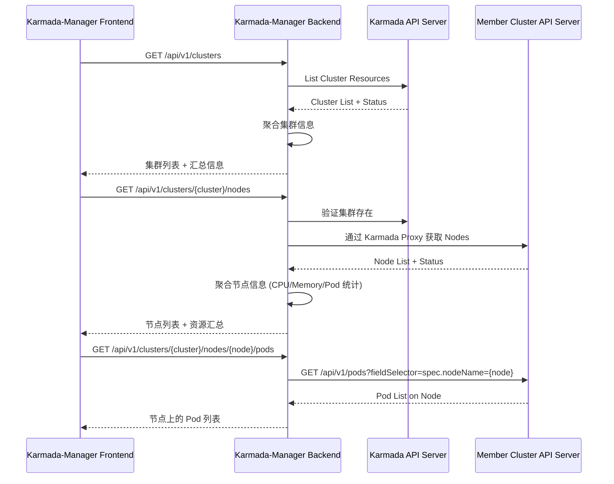
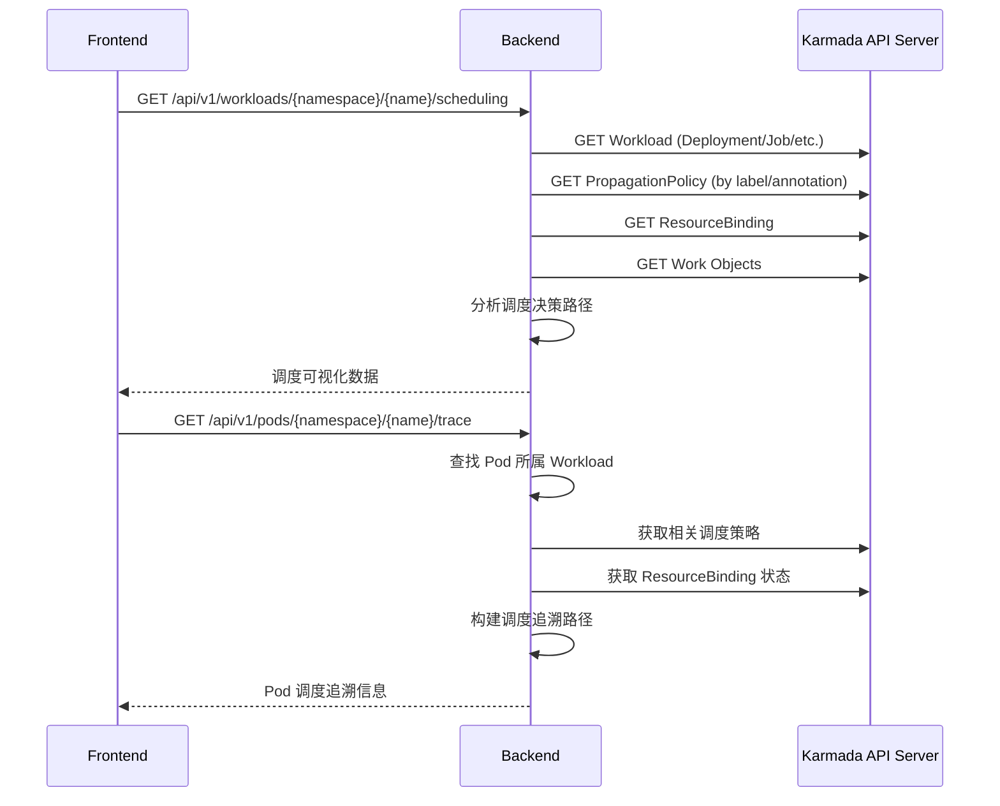
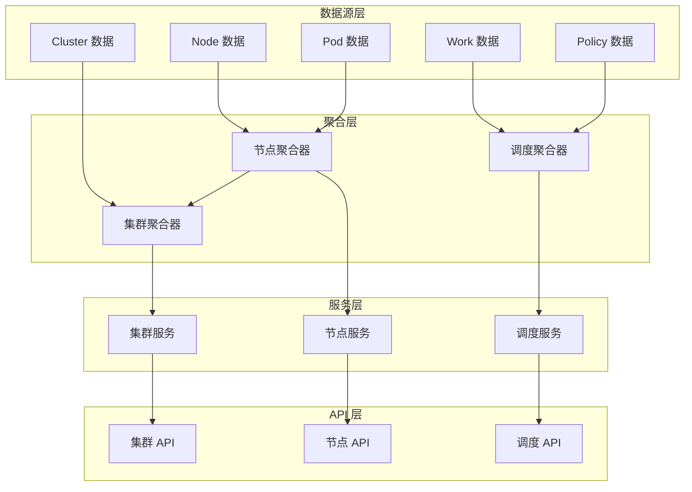
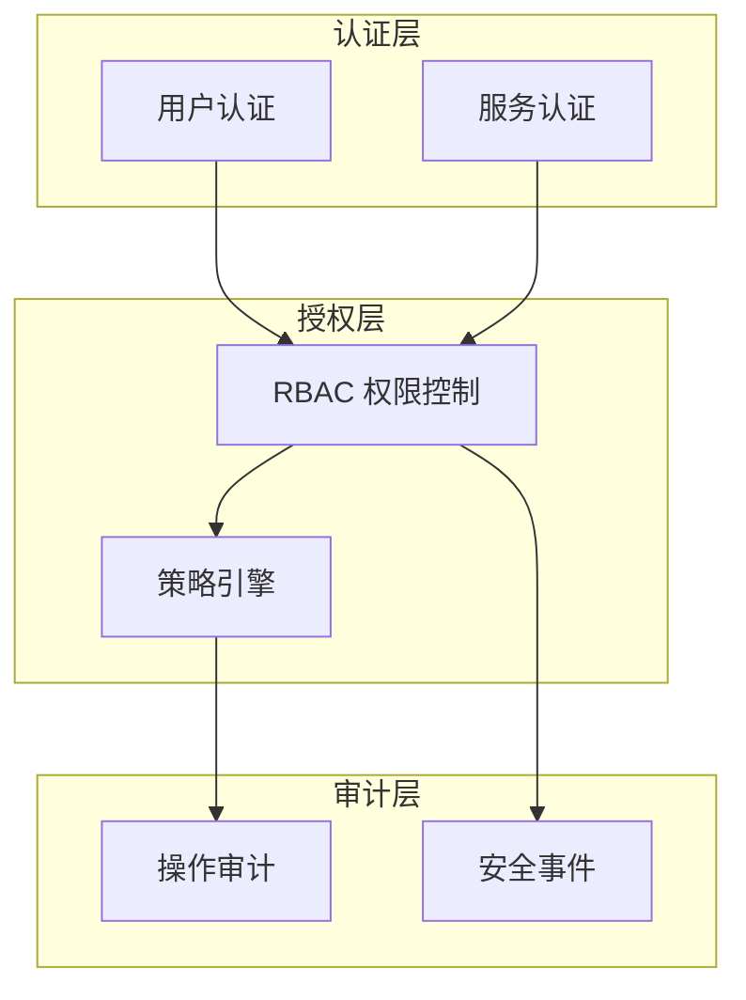

# 架构设计文档 (Arch_Spec.md) - Karmada-Manager 增强

## 1. 文档概述

本文档详细描述了 Karmada-Manager 增强功能的系统架构设计，包括组件视图、部署视图以及技术选型。旨在为开发团队提供清晰的架构指引，确保系统按照设计目标高效、稳定地实现 PRD 中定义的功能。

## 2. 系统架构图

### 2.1 组件视图 (Logical View)

```mermaid
graph TD
    subgraph Karmada-Manager
        direction LR
        KM_Frontend[Karmada-Manager Frontend (React, TypeScript)]
        KM_Backend[Karmada-Manager Backend (Golang, Gin)]
        KM_API[KM Backend API (RESTful)]
    end

    subgraph Karmada Control Plane
        Karmada_APIServer[Karmada API Server]
        Karmada_Scheduler[Karmada Scheduler]
        Karmada_Controllers[Karmada Controllers]
        ETCD_Karmada[etcd (Karmada Data Store)]
    end

    subgraph Member Clusters
        direction RL
        MemberCluster1[Member Cluster 1 API Server]
        MemberClusterN[Member Cluster N API Server]
        Nodes1[Nodes (MC1)]
        Pods1[Pods (MC1)]
        NodesN[Nodes (MCN)]
        PodsN[Pods (MCN)]
    end

    KM_Frontend -- HTTP/S --> KM_API
    KM_Backend --KM_API-- KM_Frontend

    KM_Backend -- HTTPS (Kubeconfig/SA Token) --> Karmada_APIServer

    Karmada_APIServer <--> ETCD_Karmada
    Karmada_APIServer -- Watch/Update --> Karmada_Scheduler
    Karmada_APIServer -- Watch/Update --> Karmada_Controllers

    %% Karmada-Manager Backend to Member Clusters (via Karmada Proxy or Direct)
    KM_Backend -- HTTPS (Karmada Proxy) --> MemberCluster1
    KM_Backend -- HTTPS (Karmada Proxy) --> MemberClusterN

    %% Karmada Control Plane to Member Clusters (Push/Pull Mode)
    Karmada_Controllers -- Manages --> MemberCluster1
    Karmada_Controllers -- Manages --> MemberClusterN

    MemberCluster1 --> Nodes1
    MemberCluster1 --> Pods1
    MemberClusterN --> NodesN
    MemberClusterN --> PodsN

    %% Data Flow for Information Aggregation
    Nodes1 --> MemberCluster1
    Pods1 --> MemberCluster1
    NodesN --> MemberClusterN
    PodsN --> MemberClusterN

    MemberCluster1 -- Status/Metrics (via Karmada Agent or direct query) --> Karmada_APIServer
    MemberClusterN -- Status/Metrics (via Karmada Agent or direct query) --> Karmada_APIServer

    Karmada_APIServer -- Aggregated Data --> KM_Backend

    classDef kmColor fill:#f9f,stroke:#333,stroke-width:2px;
    class KM_Frontend,KM_Backend,KM_API kmColor;

    classDef karmadaColor fill:#lightgrey,stroke:#333,stroke-width:2px;
    class Karmada_APIServer,Karmada_Scheduler,Karmada_Controllers,ETCD_Karmada karmadaColor;

    classDef memberColor fill:#lightblue,stroke:#333,stroke-width:2px;
    class MemberCluster1,MemberClusterN,Nodes1,Pods1,NodesN,PodsN memberColor;

```

**组件说明:**

*   **Karmada-Manager Frontend**: 用户交互界面，基于 React、TypeScript 和 Ant Design 构建。负责展示数据、接收用户操作，并通过 RESTful API 与后端通信。
*   **Karmada-Manager Backend**: 核心业务逻辑处理单元，基于 Golang 和 Gin 框架构建。
    *   提供 RESTful API 给前端。
    *   与 `Karmada API Server` 交互，获取集群、策略、调度结果等信息。
    *   通过 Karmada 的 `proxy` 机制或直接（需安全配置）与 `Member Cluster API Server` 交互，获取成员集群内部资源详情（如节点、Pod、日志等）。
    *   执行用户请求的修改操作（如编辑 ConfigMap）到成员集群。
    *   聚合和处理来自 Karmada 及成员集群的数据，以满足前端展示需求。
*   **Karmada Control Plane**: Karmada 系统的核心组件。
    *   `Karmada API Server`: 多集群管理的入口，存储集群、策略等 CRD。
    *   `Karmada Scheduler`: 负责将资源调度到合适的成员集群。
    *   `Karmada Controllers`: 负责同步资源到成员集群，维护状态等。
    *   `etcd`: Karmada 的后端存储。
*   **Member Clusters**: 用户实际的工作负载运行的 Kubernetes 集群。
    *   `Member Cluster API Server`: 各成员集群的 Kubernetes API 服务。
    *   `Nodes/Pods`: 成员集群中的节点和 Pod 资源。

### 2.2 部署视图 (Deployment View - Conceptual)

```mermaid
graph TD
    User[User via Browser]

    subgraph Central Management Plane (e.g., Dedicated Namespace in a K8s Cluster)
        KM_Deployment[Karmada-Manager Deployment/StatefulSet]
        KM_Service[Karmada-Manager Service (LoadBalancer/NodePort/Ingress)]
        KM_Pod1[KM Pod 1 (Frontend + Backend)]
        KM_PodN[KM Pod N (Frontend + Backend)]

        KM_Deployment --> KM_Pod1
        KM_Deployment --> KM_PodN
        KM_Service --> KM_Deployment
    end

    User -- HTTPS --> KM_Service

    KM_Pod1 -- Interacts with --> Karmada_Control_Plane[Karmada Control Plane (Potentially separate cluster or same)]
    KM_PodN -- Interacts with --> Karmada_Control_Plane

    Karmada_Control_Plane -- Manages --> Member_Clusters[Member Clusters]

    classDef user fill:#c9f,stroke:#333,stroke-width:2px;
    class User user;

    classDef kmdeploy fill:#f9f,stroke:#333,stroke-width:2px;
    class KM_Deployment,KM_Service,KM_Pod1,KM_PodN kmdeploy;

    classDef karmadaplane fill:#lightgrey,stroke:#333,stroke-width:2px;
    class Karmada_Control_Plane karmadaplane;

    classDef memberplane fill:#lightblue,stroke:#333,stroke-width:2px;
    class Member_Clusters memberplane;
```

**部署说明:**

*   **Karmada-Manager** 本身将作为一组 Pod (通过 Deployment 或 StatefulSet 管理) 部署在 Kubernetes 集群中。这个集群可以是 Karmada 控制面所在的集群，也可以是能够访问 Karmada 控制面的任何其他集群。
*   前端和后端可以打包在同一个容器镜像中，或者分开部署（但通常对于此类管理平台，合并更简单）。
*   通过 Kubernetes `Service` (如 LoadBalancer, NodePort, 或 Ingress) 暴露给用户访问。
*   Karmada-Manager Pod 需要配置合适的 `Kubeconfig` 或 `ServiceAccount` Token 以安全地访问 `Karmada API Server` 以及通过其代理访问成员集群。

## 3. 技术选型

基于 PRD (`doc/agent/PRD.md#8.1`) 和现有项目基础，技术选型如下：

### 3.1 后端技术栈

-   **语言**: Golang (Go)
    -   *理由*: Karmada 及 Kubernetes 生态系统主要使用 Golang，拥有丰富的客户端库和CRD操作能力，性能优异，适合构建云原生应用。
-   **Web 框架**: Gin
    -   *理由*: 轻量级、高性能的 Golang Web 框架，API 友好，社区活跃。 (与 `go-restful` 相比，Gin 更易上手，对于主要提供 REST API 的场景足够用)。
-   **Kubernetes 客户端**: `client-go`
    -   *理由*: 官方提供的 Go 客户端库，用于与 Kubernetes API Server (包括 Karmada API Server 和成员集群 API Server) 进行交互。
-   **API 类型**: RESTful API
    -   *理由*: 成熟、通用，易于前端集成。

### 3.2 前端技术栈

-   **语言**: TypeScript
    -   *理由*: 为 JavaScript 提供了静态类型检查，提高代码质量和可维护性。
-   **框架**: React
    -   *理由*: 强大的组件化能力，庞大的社区支持，性能良好，是现代前端开发的主流选择之一。Karmada Dashboard 可能已采用。
-   **UI 组件库**: Ant Design (或现有 Karmada Dashboard 使用的组件库)
    -   *理由*: 提供丰富、高质量的开箱即用组件，加速开发，保证 UI 一致性。与 React 良好集成。
-   **状态管理**: Redux Toolkit / Zustand / React Context API (根据项目复杂度选择)
    -   *理由*: 有效管理复杂应用的状态。
-   **数据请求**: Axios / Fetch API
    -   *理由*: 用于与后端 RESTful API 通信。

### 3.3 数据存储/缓存 (Karmada-Manager 自身)

-   **主要策略**: Karmada-Manager 优先设计为 **无状态服务**，不直接持久化存储业务数据。所有关于集群、策略、资源的数据都实时或准实时从 Karmada API Server 和成员集群 API Server 获取。
-   **缓存 (可选)**: 对于不经常变化且获取成本较高的数据（例如成员集群的某些静态属性），可以考虑引入内存缓存 (如 `go-cache`) 或外部缓存服务 (如 Redis) 来提升性能和减少对上游 API 的请求压力。MVP 阶段可以不引入外部缓存。
    -   *理由*: 提升响应速度，降低 API 调用频率。

### 3.4 认证与授权

-   **对 Karmada API Server**: 使用 Karmada 支持的认证机制，如 ServiceAccount Token 或 Kubeconfig。
-   **Karmada-Manager 用户认证 (可选，初期可简化)**: 如果需要独立的用户认证体系，可以考虑 OIDC, OAuth2, 或 LDAP 集成。MVP 阶段可能依赖于部署环境的访问控制 (如 Kubernetes Ingress 认证)。
-   **内部授权**: 基于角色的访问控制 (RBAC) 设计，后端 API 需要对用户请求进行权限校验，确保用户只能访问其有权查看或修改的资源。

## 4. 核心功能实现架构说明

### 4.1 成员集群管理增强架构

#### 4.1.1 数据流设计



#### 4.1.2 核心服务层架构

-   **ClusterService**: 负责成员集群的管理和状态聚合
    -   获取所有成员集群列表
    -   聚合集群健康状态和资源使用概览
    -   提供集群级别的操作接口
-   **NodeService**: 负责成员集群节点的管理
    -   获取指定集群的节点列表
    -   获取节点详细信息和资源分配情况
    -   聚合节点上运行的 Pod 信息
-   **PodService**: 负责 Pod 的查看和管理
    -   获取 Pod 详细信息
    -   提供 Pod 日志查看功能
    -   (可选) 提供 Pod 终端访问功能
-   **ResourceService**: 负责成员集群内 Kubernetes 资源的 CRUD 操作
    -   查看 Deployment、ConfigMap、Secret 等资源
    -   编辑和更新资源 YAML
    -   权限控制和操作审计

### 4.2 资源调度可视化与追溯架构

#### 4.2.1 调度信息数据流



#### 4.2.2 核心服务层架构

-   **SchedulingService**: 负责调度策略和结果的分析
    -   解析 PropagationPolicy 和 OverridePolicy
    -   分析 ResourceBinding 和 Work 对象状态
    -   计算集群权重和选择原因
    -   提供调度决策可视化数据
-   **TraceService**: 负责 Pod 调度路径追溯
    -   根据 Pod 查找其所属 Workload
    -   关联相关的调度策略
    -   构建完整的调度决策链路
    -   提供调度路径可视化数据

### 4.3 信息汇总架构设计

#### 4.3.1 层次化信息汇总



#### 4.3.2 数据汇总策略

1.  **节点级汇总**:
    -   聚合节点上所有 Pod 的资源使用情况
    -   计算节点的资源分配率 (Requests/Limits vs Capacity)
    -   统计节点状态和健康度指标

2.  **集群级汇总**:
    -   聚合集群内所有节点的状态信息
    -   计算集群总体资源容量和使用情况
    -   统计集群内 Pod 分布和健康状态

3.  **调度级汇总**:
    -   关联 Workload 与其调度策略
    -   计算策略执行结果与预期的匹配度
    -   提供调度决策的可视化数据

## 5. 接口设计规范

### 5.1 RESTful API 设计原则

-   遵循 RESTful 设计规范，使用标准 HTTP 方法
-   统一的响应格式和错误处理
-   支持分页、排序、过滤等通用功能
-   版本化管理 (v1, v2, etc.)

### 5.2 API 路径规范

```
/api/v1/clusters                                    # 集群列表
/api/v1/clusters/{cluster}                          # 集群详情
/api/v1/clusters/{cluster}/nodes                    # 集群节点列表
/api/v1/clusters/{cluster}/nodes/{node}             # 节点详情
/api/v1/clusters/{cluster}/nodes/{node}/pods        # 节点上的 Pod 列表
/api/v1/clusters/{cluster}/pods                     # 集群 Pod 列表
/api/v1/clusters/{cluster}/pods/{namespace}/{name}  # Pod 详情
/api/v1/clusters/{cluster}/pods/{namespace}/{name}/logs # Pod 日志
/api/v1/workloads/{namespace}/{name}/scheduling     # Workload 调度信息
/api/v1/pods/{namespace}/{name}/trace               # Pod 调度追溯
```

### 5.3 数据模型设计

#### 5.3.1 集群视图模型

```go
type ClusterView struct {
    ObjectMeta   `json:"objectMeta"`
    Status       ClusterStatus   `json:"status"`
    NodeSummary  NodeSummary     `json:"nodeSummary"`
    ResourceSummary ResourceSummary `json:"resourceSummary"`
    Conditions   []ClusterCondition `json:"conditions"`
}

type NodeSummary struct {
    TotalCount int `json:"totalCount"`
    ReadyCount int `json:"readyCount"`
}

type ResourceSummary struct {
    CPU    ResourceInfo `json:"cpu"`
    Memory ResourceInfo `json:"memory"`
    Pods   ResourceInfo `json:"pods"`
}

type ResourceInfo struct {
    Capacity    string `json:"capacity"`
    Allocatable string `json:"allocatable"`
    Allocated   string `json:"allocated"`
    Utilization string `json:"utilization"`
}
```

#### 5.3.2 节点视图模型

```go
type NodeView struct {
    ObjectMeta      `json:"objectMeta"`
    Status          v1.NodeStatus `json:"status"`
    PodSummary      PodSummary    `json:"podSummary"`
    ResourceSummary ResourceSummary `json:"resourceSummary"`
    ClusterName     string        `json:"clusterName"`
}

type PodSummary struct {
    TotalCount   int `json:"totalCount"`
    RunningCount int `json:"runningCount"`
    PendingCount int `json:"pendingCount"`
    FailedCount  int `json:"failedCount"`
}
```

#### 5.3.3 调度视图模型

```go
type SchedulingView struct {
    WorkloadInfo    WorkloadInfo    `json:"workloadInfo"`
    PropagationPolicy PolicyInfo    `json:"propagationPolicy,omitempty"`
    OverridePolicy    PolicyInfo    `json:"overridePolicy,omitempty"`
    ClusterPlacements []ClusterPlacement `json:"clusterPlacements"`
    SchedulingStatus  SchedulingStatus   `json:"schedulingStatus"`
}

type ClusterPlacement struct {
    ClusterName     string `json:"clusterName"`
    PlannedReplicas int32  `json:"plannedReplicas"`
    ActualReplicas  int32  `json:"actualReplicas"`
    Weight          int32  `json:"weight,omitempty"`
    Reason          string `json:"reason"`
}

type PodTraceView struct {
    PodInfo       PodInfo         `json:"podInfo"`
    WorkloadInfo  WorkloadInfo    `json:"workloadInfo"`
    SchedulingPath []SchedulingStep `json:"schedulingPath"`
    FinalPlacement FinalPlacement  `json:"finalPlacement"`
}

type SchedulingStep struct {
    StepType    string `json:"stepType"`    // "policy_match", "cluster_select", "replica_assign", "node_schedule"
    Description string `json:"description"`
    Details     interface{} `json:"details"`
}
```

## 6. 安全架构设计

### 6.1 认证与授权架构



### 6.2 安全策略

-   **最小权限原则**: 用户和服务账户仅获得完成任务所需的最小权限
-   **零信任架构**: 对所有请求进行验证，不信任网络位置
-   **操作审计**: 记录所有关键操作，特别是对成员集群的修改操作
-   **数据脱敏**: 对敏感信息进行脱敏处理，如 Secret 内容

## 7. 性能与可扩展性设计

### 7.1 性能优化策略

-   **缓存策略**: 对不经常变化的数据进行缓存
-   **异步处理**: 对耗时操作使用异步处理
-   **分页加载**: 对大量数据使用分页和懒加载
-   **连接池**: 复用 Kubernetes 客户端连接

### 7.2 可扩展性设计

-   **水平扩展**: Backend 服务支持多实例部署
-   **负载均衡**: 使用 Kubernetes Service 进行负载均衡
-   **资源限制**: 设置合理的资源请求和限制

## 8. 监控与可观测性

### 8.1 监控指标

-   **业务指标**: API 响应时间、错误率、调用量
-   **系统指标**: CPU、内存、网络使用率
-   **Kubernetes 指标**: Pod 健康状态、资源使用情况

### 8.2 日志规范

-   **结构化日志**: 使用 JSON 格式的结构化日志
-   **分级记录**: 区分 Debug、Info、Warn、Error 级别
-   **关键操作记录**: 记录所有的 CRUD 操作和用户行为

### 8.3 链路追踪

-   **请求追踪**: 使用 OpenTelemetry 进行请求链路追踪
-   **性能分析**: 识别性能瓶颈和优化点 