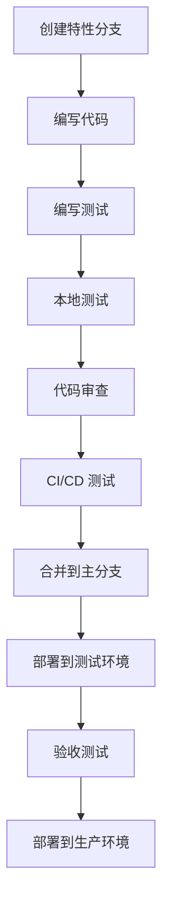

# 开发指南 (Guide_Spec.md) - Karmada-Manager 增强

## 1. 文档概述

本文档为 Karmada-Manager 增强功能的开发团队提供详细的开发指南，包括环境搭建、编码规范、测试策略、部署流程等。确保团队成员能够高效、规范地进行开发工作。

## 2. 开发环境搭建

### 2.1 基础环境要求

#### 2.1.1 软件依赖

```bash
# Go 开发环境
Go 1.20+ 
Git 2.30+
Docker 20.10+
Kubernetes 1.24+

# 前端开发环境 (可选)
Node.js 18+
npm 8+ / yarn 1.22+

# 开发工具
kubectl 1.24+
helm 3.8+
kind/minikube (本地测试)
```

#### 2.1.2 IDE 配置推荐

**VS Code 扩展:**
```json
{
  "recommendations": [
    "golang.go",
    "ms-kubernetes-tools.vscode-kubernetes-tools",
    "redhat.vscode-yaml",
    "ms-vscode.vscode-json",
    "bradlc.vscode-tailwindcss"
  ]
}
```

**GoLand/IntelliJ IDEA:**
- Go Plugin
- Kubernetes Plugin
- YAML/JSON 支持

### 2.2 项目克隆与构建

```bash
# 1. 克隆项目
git clone https://github.com/karmada-io/dashboard.git
cd dashboard

# 2. 安装 Go 依赖
go mod download
go mod verify

# 3. 构建项目
make build

# 4. 验证构建
./_output/bin/linux/amd64/karmada-dashboard-api --help
```

### 2.3 本地开发环境

#### 2.3.1 使用 Kind 搭建本地 Karmada 集群

```bash
# 1. 创建 Kind 集群
cat <<EOF | kind create cluster --config=-
kind: Cluster
apiVersion: kind.x-k8s.io/v1alpha4
name: karmada-host
nodes:
- role: control-plane
  extraPortMappings:
  - containerPort: 32443
    hostPort: 32443
    protocol: TCP
EOF

# 2. 安装 Karmada
curl -s https://raw.githubusercontent.com/karmada-io/karmada/master/hack/local-up-karmada.sh | bash

# 3. 创建成员集群
kind create cluster --name member1
kind create cluster --name member2

# 4. 注册成员集群到 Karmada
kubectl karmada join member1 --cluster-kubeconfig=$HOME/.kube/config
kubectl karmada join member2 --cluster-kubeconfig=$HOME/.kube/config
```

#### 2.3.2 配置开发环境变量

```bash
# 创建 .env 文件
cat > .env <<EOF
# Karmada 配置
KARMADA_APISERVER_URL=https://localhost:32443
KARMADA_KUBECONFIG=$HOME/.kube/karmada.config

# 开发配置
DEV_MODE=true
LOG_LEVEL=debug
METRICS_PORT=9090

# 缓存配置 (可选)
REDIS_ENABLED=false
CACHE_TTL=300s

# 功能开关
ENABLE_POD_TERMINAL=false
ENABLE_RESOURCE_EDIT=true
ENABLE_SCHEDULING_TRACE=true
EOF

# 加载环境变量
source .env
```

### 2.4 开发时热重载配置

```bash
# 安装 Air (Go 热重载工具)
go install github.com/cosmtrek/air@latest

# 创建 .air.toml 配置
cat > .air.toml <<EOF
root = "."
tmp_dir = "tmp"

[build]
cmd = "go build -o tmp/main ./cmd/api/main.go"
bin = "tmp/main"
full_bin = "tmp/main --kubeconfig=$KARMADA_KUBECONFIG --karmada-context=karmada-apiserver"
include_ext = ["go", "tpl", "tmpl", "html"]
exclude_dir = ["assets", "tmp", "vendor", "_output"]

[log]
time = true

[color]
main = "magenta"
watcher = "cyan"
build = "yellow"
runner = "green"
EOF

# 启动热重载开发
air
```

## 3. 代码结构与架构

### 3.1 项目目录结构

```
.
├── cmd/                        # 应用入口
│   └── api/                   # API 服务
│       ├── main.go           # 主入口
│       └── app/              # 应用逻辑
├── pkg/                       # 核心包
│   ├── client/               # Kubernetes 客户端
│   ├── resource/             # 资源处理
│   ├── service/              # 业务服务层 (新增)
│   ├── cache/                # 缓存管理 (新增)
│   ├── aggregator/           # 数据聚合器 (新增)
│   └── common/               # 通用工具
├── internal/                  # 内部包 (新增)
│   ├── scheduler/            # 调度分析
│   ├── trace/                # 调度追溯
│   └── metrics/              # 监控指标
├── docs/                     # 文档
├── deploy/                   # 部署配置
├── test/                     # 测试
│   ├── unit/                 # 单元测试
│   ├── integration/          # 集成测试
│   └── e2e/                  # 端到端测试
└── scripts/                  # 工具脚本
```

### 3.2 分层架构设计

```
┌─────────────────────────────────────┐
│           API Layer                 │  <- HTTP Handlers
├─────────────────────────────────────┤
│          Service Layer              │  <- Business Logic
├─────────────────────────────────────┤
│         Aggregator Layer            │  <- Data Aggregation
├─────────────────────────────────────┤
│          Cache Layer                │  <- Caching Strategy
├─────────────────────────────────────┤
│          Client Layer               │  <- K8s API Clients
└─────────────────────────────────────┘
```

### 3.3 核心包设计原则

- **单一职责**: 每个包专注于一个领域
- **依赖倒置**: 高层模块不依赖低层模块，都依赖抽象
- **接口隔离**: 定义细粒度的接口
- **开闭原则**: 对扩展开放，对修改关闭

## 4. 编码规范

### 4.1 Go 代码规范

#### 4.1.1 命名规范

```go
// 包名：小写，简短，有意义
package cluster

// 接口名：动词 + er 或 名词 + Interface
type ClusterManager interface {}
type DataAggregatorInterface interface {}

// 结构体名：帕斯卡命名法
type ClusterView struct {}
type NodeSummary struct {}

// 方法名：帕斯卡命名法，动词开头
func (c *ClusterService) GetClusterList() {}
func (n *NodeService) AggregateNodeInfo() {}

// 变量名：驼峰命名法
var clusterName string
var nodeCount int

// 常量名：全大写，下划线分隔
const (
    DEFAULT_TIMEOUT = 30 * time.Second
    MAX_RETRY_COUNT = 3
)
```

#### 4.1.2 错误处理规范

```go
// 错误定义
var (
    ErrClusterNotFound   = errors.New("cluster not found")
    ErrNodeNotReady      = errors.New("node is not ready")
    ErrInsufficientPerms = errors.New("insufficient permissions")
)

// 错误包装
func GetClusterDetail(name string) (*ClusterView, error) {
    cluster, err := client.GetCluster(name)
    if err != nil {
        return nil, fmt.Errorf("failed to get cluster %s: %w", name, err)
    }
    return toClusterView(cluster), nil
}

// 错误处理
if err := validateClusterName(name); err != nil {
    return nil, fmt.Errorf("invalid cluster name: %w", err)
}
```

#### 4.1.3 日志规范

```go
import "k8s.io/klog/v2"

// 结构化日志
klog.InfoS("Starting cluster aggregation", 
    "clusterCount", len(clusters),
    "timeout", timeout.String())

// 错误日志
klog.ErrorS(err, "Failed to get node list", 
    "cluster", clusterName,
    "operation", "GetNodeList")

// 调试日志
klog.V(4).InfoS("Cache hit", 
    "key", cacheKey,
    "ttl", ttl.String())
```

### 4.2 API 设计规范

#### 4.2.1 RESTful 设计

```go
// 资源路径设计
GET    /api/v1/clusters                     # 获取集群列表
GET    /api/v1/clusters/{cluster}           # 获取集群详情
GET    /api/v1/clusters/{cluster}/nodes     # 获取节点列表
POST   /api/v1/clusters/{cluster}/actions/restart # 集群操作

// 避免动词路径
❌ /api/v1/getClusters
❌ /api/v1/createCluster
✅ /api/v1/clusters
```

#### 4.2.2 请求/响应结构

```go
// 统一响应结构
type APIResponse struct {
    Code      int         `json:"code"`
    Message   string      `json:"message"`
    Data      interface{} `json:"data,omitempty"`
    Error     string      `json:"error,omitempty"`
    Timestamp time.Time   `json:"timestamp"`
}

// 分页结构
type ListMeta struct {
    TotalItems   int `json:"totalItems"`
    ItemsPerPage int `json:"itemsPerPage"`
    CurrentPage  int `json:"currentPage"`
}

// 查询参数结构
type ListOptions struct {
    Page         int    `form:"page,default=1"`
    Limit        int    `form:"limit,default=10"`
    SortBy       string `form:"sortBy"`
    SortOrder    string `form:"sortOrder,default=asc"`
    FilterBy     string `form:"filterBy"`
}
```

### 4.3 测试规范

#### 4.3.1 单元测试

```go
// 测试文件命名：*_test.go
// 测试函数命名：TestFunctionName

func TestClusterService_GetClusterList(t *testing.T) {
    // 使用 testify 框架
    tests := []struct {
        name    string
        setup   func() *ClusterService
        want    int
        wantErr bool
    }{
        {
            name: "successful get cluster list",
            setup: func() *ClusterService {
                mockClient := &MockKarmadaClient{}
                mockClient.On("ListClusters").Return(mockClusters, nil)
                return NewClusterService(mockClient)
            },
            want:    3,
            wantErr: false,
        },
    }
    
    for _, tt := range tests {
        t.Run(tt.name, func(t *testing.T) {
            service := tt.setup()
            got, err := service.GetClusterList(context.Background())
            
            if tt.wantErr {
                assert.Error(t, err)
                return
            }
            
            assert.NoError(t, err)
            assert.Len(t, got.Items, tt.want)
        })
    }
}
```

#### 4.3.2 集成测试

```go
func TestClusterIntegration(t *testing.T) {
    if testing.Short() {
        t.Skip("skipping integration test")
    }
    
    // 使用真实的 Kubernetes 客户端
    client := setupTestClient(t)
    service := NewClusterService(client)
    
    // 测试实际的集群操作
    clusters, err := service.GetClusterList(context.Background())
    require.NoError(t, err)
    assert.NotEmpty(t, clusters.Items)
}
```

## 5. 开发流程

### 5.1 特性开发流程



#### 5.1.1 分支策略

```bash
# 主分支
main                    # 生产环境代码
develop                 # 开发主分支

# 特性分支
feature/cluster-enhance # 特性开发
bugfix/node-list-error  # 错误修复
hotfix/security-patch   # 紧急修复

# 分支创建
git checkout -b feature/scheduling-trace
```

#### 5.1.2 提交规范

```bash
# 提交信息格式
<type>(<scope>): <subject>

<body>

<footer>

# 类型定义
feat:     新功能
fix:      错误修复  
docs:     文档更新
style:    代码格式
refactor: 重构
test:     测试相关
chore:    构建工具

# 示例
feat(cluster): add node-level resource aggregation

- Implement node resource summary calculation
- Add cache layer for node information
- Support real-time resource utilization display

Closes #123
```

### 5.2 代码审查清单

#### 5.2.1 功能审查

- [ ] 功能是否符合 PRD 要求
- [ ] API 接口设计是否合理
- [ ] 错误处理是否完善
- [ ] 日志记录是否充分
- [ ] 性能是否满足要求

#### 5.2.2 代码质量审查

- [ ] 代码是否遵循编码规范
- [ ] 变量命名是否清晰
- [ ] 函数是否单一职责
- [ ] 是否有代码重复
- [ ] 注释是否充分

#### 5.2.3 安全审查

- [ ] 输入验证是否充分
- [ ] 权限控制是否正确
- [ ] 敏感信息是否泄露
- [ ] SQL 注入防护
- [ ] XSS 防护

### 5.3 测试策略

#### 5.3.1 测试金字塔

```
         /\
        /  \
       /E2E \     <- 少量端到端测试
      /______\
     /        \
    /Integration\ <- 适量集成测试  
   /____________\
  /              \
 /   Unit Tests   \ <- 大量单元测试
/__________________\
```

#### 5.3.2 测试命令

```bash
# 单元测试
go test ./pkg/... -v -cover

# 集成测试
go test ./test/integration/... -v -tags=integration

# 端到端测试
go test ./test/e2e/... -v -tags=e2e

# 覆盖率报告
go test ./... -coverprofile=coverage.out
go tool cover -html=coverage.out -o coverage.html
```

## 6. 调试与故障排查

### 6.1 本地调试

#### 6.1.1 使用 Delve 调试器

```bash
# 安装 Delve
go install github.com/go-delve/delve/cmd/dlv@latest

# 启动调试模式
dlv debug ./cmd/api/main.go -- --kubeconfig=$HOME/.kube/config

# 设置断点
(dlv) break main.main
(dlv) break pkg/service/cluster.go:45
(dlv) continue
```

#### 6.1.2 调试配置

```json
// .vscode/launch.json
{
    "version": "0.2.0",
    "configurations": [
        {
            "name": "Debug API Server",
            "type": "go",
            "request": "launch",
            "mode": "auto",
            "program": "${workspaceFolder}/cmd/api/main.go",
            "args": [
                "--kubeconfig=${env:HOME}/.kube/config",
                "--karmada-context=karmada-apiserver"
            ],
            "env": {
                "LOG_LEVEL": "debug"
            }
        }
    ]
}
```

### 6.2 日志分析

#### 6.2.1 日志级别

```go
// 日志级别使用指南
klog.V(0).Info()  // 重要信息，总是显示
klog.V(1).Info()  // 一般信息  
klog.V(2).Info()  // 详细信息
klog.V(3).Info()  // 调试信息
klog.V(4).Info()  // 详细调试信息
```

#### 6.2.2 结构化日志查询

```bash
# 查看特定组件日志
kubectl logs -f deployment/karmada-manager-api | jq 'select(.component == "cluster-service")'

# 查看错误日志
kubectl logs deployment/karmada-manager-api | jq 'select(.level == "error")'

# 查看性能日志
kubectl logs deployment/karmada-manager-api | jq 'select(.msg | contains("duration"))'
```

### 6.3 性能分析

#### 6.3.1 CPU 性能分析

```bash
# 启用 pprof
go tool pprof http://localhost:8080/debug/pprof/profile?seconds=30

# 分析结果
(pprof) top10
(pprof) list functionName
(pprof) web
```

#### 6.3.2 内存分析

```bash
# 内存使用分析
go tool pprof http://localhost:8080/debug/pprof/heap

# Goroutine 分析
go tool pprof http://localhost:8080/debug/pprof/goroutine
```

## 7. 部署与运维

### 7.1 构建流程

#### 7.1.1 本地构建

```bash
# 构建二进制文件
make build

# 构建 Docker 镜像
make docker-build

# 推送镜像
make docker-push
```

#### 7.1.2 CI/CD 流程

```yaml
# .github/workflows/ci.yml
name: CI/CD Pipeline

on:
  push:
    branches: [ main, develop ]
  pull_request:
    branches: [ main ]

jobs:
  test:
    runs-on: ubuntu-latest
    steps:
    - uses: actions/checkout@v3
    - uses: actions/setup-go@v3
      with:
        go-version: '1.20'
    
    - name: Run tests
      run: |
        go test ./... -v -coverprofile=coverage.out
        
    - name: Upload coverage
      uses: codecov/codecov-action@v3
      
  build:
    needs: test
    runs-on: ubuntu-latest
    steps:
    - name: Build and push Docker image
      run: |
        make docker-build
        make docker-push
```

### 7.2 部署配置

#### 7.2.1 Kubernetes 部署

```yaml
# deploy/deployment.yaml
apiVersion: apps/v1
kind: Deployment
metadata:
  name: karmada-manager-api
  namespace: karmada-system
spec:
  replicas: 2
  selector:
    matchLabels:
      app: karmada-manager-api
  template:
    metadata:
      labels:
        app: karmada-manager-api
    spec:
      containers:
      - name: api
        image: karmada/dashboard-api:latest
        ports:
        - containerPort: 8080
        env:
        - name: LOG_LEVEL
          value: "info"
        resources:
          requests:
            cpu: 100m
            memory: 128Mi
          limits:
            cpu: 500m
            memory: 512Mi
        livenessProbe:
          httpGet:
            path: /healthz
            port: 8080
          initialDelaySeconds: 30
          periodSeconds: 10
        readinessProbe:
          httpGet:
            path: /readyz
            port: 8080
          initialDelaySeconds: 5
          periodSeconds: 5
```

#### 7.2.2 配置管理

```yaml
# deploy/configmap.yaml
apiVersion: v1
kind: ConfigMap
metadata:
  name: karmada-manager-config
  namespace: karmada-system
data:
  config.yaml: |
    server:
      port: 8080
      timeout: 30s
    cache:
      enabled: true
      ttl: 300s
    features:
      schedulingTrace: true
      resourceEdit: true
```

### 7.3 监控告警

#### 7.3.1 Prometheus 监控

```yaml
# deploy/servicemonitor.yaml
apiVersion: monitoring.coreos.com/v1
kind: ServiceMonitor
metadata:
  name: karmada-manager-api
spec:
  selector:
    matchLabels:
      app: karmada-manager-api
  endpoints:
  - port: metrics
    interval: 30s
    path: /metrics
```

#### 7.3.2 告警规则

```yaml
# deploy/prometheusrule.yaml
apiVersion: monitoring.coreos.com/v1
kind: PrometheusRule
metadata:
  name: karmada-manager-alerts
spec:
  groups:
  - name: karmada-manager
    rules:
    - alert: KarmadaManagerAPIDown
      expr: up{job="karmada-manager-api"} == 0
      for: 1m
      labels:
        severity: critical
      annotations:
        summary: "Karmada Manager API is down"
        
    - alert: HighAPILatency
      expr: histogram_quantile(0.95, rate(http_request_duration_seconds_bucket[5m])) > 1
      for: 5m
      labels:
        severity: warning
      annotations:
        summary: "High API latency detected"
```

## 8. 常见问题与解决方案

### 8.1 开发环境问题

#### 8.1.1 连接 Karmada 失败

```bash
# 检查 Karmada 状态
kubectl get clusters --context=karmada-apiserver

# 检查证书
kubectl config view --context=karmada-apiserver

# 重新生成配置
karmadactl config
```

#### 8.1.2 依赖版本冲突

```bash
# 清理模块缓存
go clean -modcache

# 重新下载依赖
go mod download

# 更新依赖
go mod tidy
```

### 8.2 运行时问题

#### 8.2.1 内存泄漏

```go
// 检查 Goroutine 泄漏
func checkGoroutines() {
    if runtime.NumGoroutine() > 1000 {
        klog.Warning("High number of goroutines detected", 
            "count", runtime.NumGoroutine())
    }
}

// 正确关闭资源
defer func() {
    if closer, ok := client.(io.Closer); ok {
        closer.Close()
    }
}()
```

#### 8.2.2 API 超时

```go
// 设置合理的超时
ctx, cancel := context.WithTimeout(context.Background(), 30*time.Second)
defer cancel()

// 使用带超时的客户端
client := &http.Client{
    Timeout: 30 * time.Second,
}
```

### 8.3 性能优化

#### 8.3.1 缓存优化

```go
// 使用本地缓存减少 API 调用
func (s *ClusterService) GetClusterWithCache(name string) (*Cluster, error) {
    // 检查缓存
    if cached, found := s.cache.Get(name); found {
        return cached.(*Cluster), nil
    }
    
    // 从 API 获取
    cluster, err := s.client.GetCluster(name)
    if err != nil {
        return nil, err
    }
    
    // 存入缓存
    s.cache.Set(name, cluster, 5*time.Minute)
    return cluster, nil
}
```

#### 8.3.2 并发优化

```go
// 使用 Worker Pool 处理并发请求
func (s *NodeService) GetAllNodesInParallel(clusters []string) ([]*Node, error) {
    var wg sync.WaitGroup
    nodes := make(chan *Node, len(clusters)*100)
    errors := make(chan error, len(clusters))
    
    // 限制并发数
    semaphore := make(chan struct{}, 10)
    
    for _, cluster := range clusters {
        wg.Add(1)
        go func(clusterName string) {
            defer wg.Done()
            semaphore <- struct{}{}
            defer func() { <-semaphore }()
            
            clusterNodes, err := s.getNodesForCluster(clusterName)
            if err != nil {
                errors <- err
                return
            }
            
            for _, node := range clusterNodes {
                nodes <- node
            }
        }(cluster)
    }
    
    wg.Wait()
    close(nodes)
    close(errors)
    
    // 处理结果...
}
```

这个开发指南为团队提供了完整的开发流程和最佳实践，确保高质量的代码交付。 