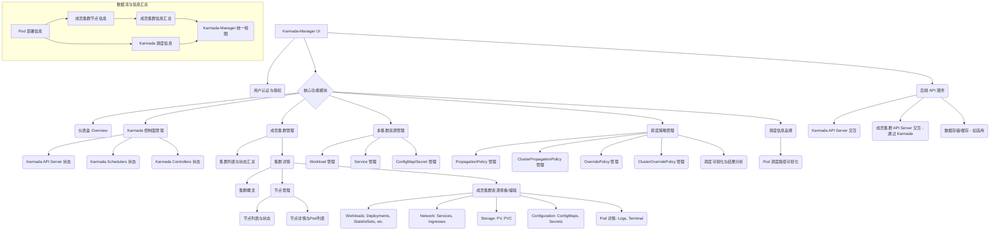
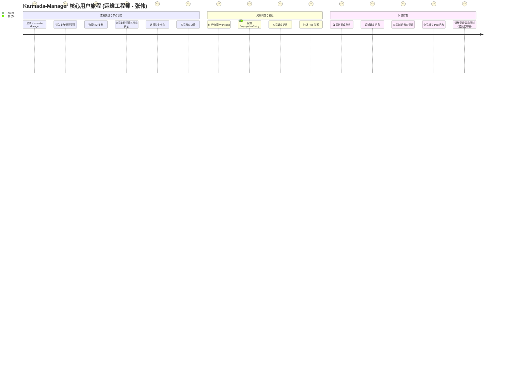
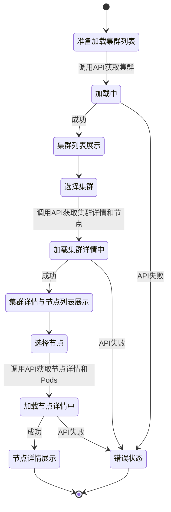

# 产品需求文档 (PRD) - Karmada-Manager 增强

## 1. 文档信息

### 1.1 版本历史

| 版本号 | 日期       | 作者     | 变更说明           |
| ------ | ---------- | -------- | ------------------ |
| 0.1    | {{CURRENT_DATE}} | 产品经理 | 初稿创建，核心需求定义 |

### 1.2 文档目的

本文档旨在详细定义 Karmada-Manager 的增强功能，主要围绕下属集群的精细化管理、资源调度控制以及调度信息可视化。本文档将作为产品团队（设计、开发、测试）进行后续工作的核心依据。

### 1.3 相关文档引用

- `doc/agent/Roadmap.md`
- `doc/agent/User_Story_Map.md`
- `doc/agent/Metrics_Framework.md`
- [Karmada 官方文档](https://karmada.io/docs/)

## 2. 产品概述

### 2.1 产品名称与定位

- **产品名称**: Karmada-Manager (增强版)
- **产品定位**: 一个强大且直观的管理平台，用于监控和管理 Karmada 控制平面及其纳管的成员集群。它不仅提供 Karmada 核心功能的可视化操作，还增强了对成员集群内部资源的管理能力、资源调度的透明度以及精细化控制。

### 2.2 产品愿景与使命

- **产品愿景**: 成为业界领先的多集群管理和调度平台，简化云原生应用的跨集群管理和交付。
- **产品使命**: 为用户提供一个集中化、可视化、智能化的 Karmada 管理界面，提升多集群环境下的运维效率、资源利用率和应用可靠性。

### 2.3 价值主张与独特卖点 (USP)

- **价值主张**:
    - **简化管理**: 通过统一界面管理所有 Karmada 集群和成员集群。
    - **提升效率**: 自动化和可视化常用操作，减少手动干预。
    - **增强洞察**: 提供深入的集群状态、资源利用率和调度信息的可视化。
    - **优化调度**: 基于 Karmada 的调度能力，提供更直观的资源调度配置和监控。
- **独特卖点 (USP)**:
    - **成员集群节点级可见性**: 深入到成员集群的节点层面进行监控和信息汇总。
    - **端到端的调度可视化**: 清晰展示从 Karmada 调度策略到资源在特定成员集群节点上部署的全过程。
    - **精细化资源控制**: 允许用户在 Karmada-Manager 中直接修改和查看成员集群的特定资源。

### 2.4 目标平台列表

- **Web**: Karmada-Manager 的主要访问方式为 Web 浏览器。

### 2.5 产品核心假设

- 用户具备 Kubernetes 和 Karmada 的基本知识。
- 用户需要一个比命令行工具更直观、更高效的方式来管理多集群环境。
- 提升资源调度过程的透明度和可追溯性对用户至关重要。
- 对成员集群内部状态的深入了解有助于用户做出更明智的决策。

### 2.6 商业模式概述 (如适用)

Karmada-Manager 作为开源项目 Karmada 的一部分，其主要价值在于提升 Karmada 生态的完整性和用户体验，间接促进 Karmada 的采纳和社区发展。当前阶段不考虑直接的商业化盈利模式。

## 3. 用户研究

### 3.1 目标用户画像

#### 3.1.1 "云原生平台运维工程师" - 张伟

- **人口统计特征**:
    - 年龄: 28-45岁
    - 性别: 男性为主
    - 教育背景: 计算机科学、软件工程或相关专业本科及以上学历
    - 职位: 平台运维工程师、SRE、DevOps 工程师
    - 工作经验: 3-10年 Kubernetes 及云原生相关经验
- **行为习惯与偏好**:
    - 习惯使用 Prometheus, Grafana, ELK 等监控工具。
    - 偏好自动化和声明式 API。
    - 经常使用 kubectl 与 Kubernetes 集群交互。
    - 关注技术社区、博客和开源项目。
    - 重视系统的稳定性和可观测性。
- **核心需求与痛点**:
    - **需求**:
        - 统一管理多个 Kubernetes 集群。
        - 快速定位和解决跨集群应用部署和运行问题。
        - 高效分配和调度资源到不同集群。
        - 实时监控集群和应用健康状态。
        - 简化 Karmada 调度策略的配置和验证。
    - **痛点**:
        - 在多个集群间切换上下文进行操作非常繁琐。
        - 难以追踪资源（如 Pod）在多集群环境中的最终部署位置和状态。
        - Karmada 的调度策略配置相对复杂，缺乏直观的界面进行验证和调整。
        - 现有监控工具可能无法很好地聚合多集群信息，特别是与 Karmada 调度策略结合的视图。
- **动机与目标**:
    - **动机**: 提升工作效率，减少手动操作和故障排查时间，保障业务应用的高可用性。
    - **目标**: 实现对多集群环境的轻松掌控，确保资源得到有效利用，应用按预期部署和运行。

#### 3.1.2 "应用开发者" - 李娜

- **人口统计特征**:
    - 年龄: 25-35岁
    - 性别: 不限
    - 教育背景: 计算机相关专业
    - 职位: 后端开发者、全栈开发者
    - 工作经验: 2-8年应用开发经验，开始接触或使用 Kubernetes 进行应用部署
- **行为习惯与偏好**:
    - 关注应用本身的逻辑实现和快速迭代。
    - 希望基础设施尽可能透明，减少运维负担。
    - 可能不深入了解 Kubernetes 或 Karmada 的底层细节。
- **核心需求与痛点**:
    - **需求**:
        - 了解自己的应用被部署到了哪些集群，运行状态如何。
        - 简单查看应用的日志和事件。
        - 当应用出现问题时，能快速获得相关信息以辅助排查。
    - **痛点**:
        - 对多集群部署的复杂度感到困惑。
        - 不清楚资源调度的具体逻辑，难以预测应用会落在哪个集群。
- **动机与目标**:
    - **动机**: 确保自己的应用能够顺利部署并稳定运行，快速响应业务需求。
    - **目标**: 减少在基础设施问题上花费的时间，更专注于应用开发。

### 3.2 用户场景分析

#### 3.2.1 核心使用场景详述

1.  **场景1: 查看成员集群整体状态和节点详情**
    *   **用户**: 平台运维工程师 (张伟)
    *   **用户故事**: 作为一名平台运维工程师，我想要在 Karmada-Manager 中清晰地看到所有成员集群的健康状态、资源使用概览（CPU、内存、Pod），并且能够进一步钻取到特定集群的节点列表，查看每个节点的详细信息（状态、资源、运行的 Pods），以便我能够快速评估集群容量和健康度。
    *   **流程**:
        1.  张伟登录 Karmada-Manager。
        2.  进入"集群管理"页面，看到所有已纳管的成员集群列表。
        3.  列表中展示每个集群的关键信息：名称、状态、版本、节点数（Ready/Total）、资源总量及已分配量（CPU、内存、Pod）。
        4.  张伟点击某个集群，进入该集群的详情页。
        5.  详情页顶部展示集群的汇总信息。
        6.  下方展示该集群的节点列表，包含节点名称、状态、IP 地址、资源（请求/限制/容量）、Pod 数量等。
        7.  张伟点击某个节点，可以查看到该节点的详细描述信息（类似 `kubectl describe node`）以及在该节点上运行的 Pod 列表（及其基本信息如命名空间、状态、重启次数）。
2.  **场景2: 管理（查看/修改）成员集群中的特定资源**
    *   **用户**: 平台运维工程师 (张伟)
    *   **用户故事**: 作为一名平台运维工程师，我想要在 Karmada-Manager 中直接查看和修改某个成员集群中的特定 Kubernetes 资源（例如 Deployment, Pod, ConfigMap），而不需要直接登录到该成员集群操作 kubectl，以便我能快速进行故障排查或小的配置调整。
    *   **流程**:
        1.  张伟在成员集群详情页或通过全局资源搜索定位到需要操作的资源。
        2.  例如，他想查看集群 A 中的 `nginx-deployment`。
        3.  他可以通过集群详情页的"工作负载"找到 Deployment 列表，然后筛选或搜索到 `nginx-deployment`。
        4.  点击 `nginx-deployment`，可以查看到其 YAML 定义、Pod 状态、事件等。
        5.  提供编辑 YAML 的功能，允许张伟修改后应用到该成员集群。
        6.  对于 Pod，提供查看日志、进入终端 (可选) 的功能。
3.  **场景3: 可视化资源调度策略和结果**
    *   **用户**: 平台运维工程师 (张伟)
    *   **用户故事**: 作为一名平台运维工程师，我想要在 Karmada-Manager 中创建一个 PropagationPolicy (或 OverridePolicy)，并清晰地看到这个策略是如何将我的应用（如 Deployment）调度到哪些成员集群的，以及每个集群分配了多少实例 (replicas)，以便我能直观地理解和验证我的调度意图。
    *   **流程**:
        1.  张伟创建一个 Deployment 资源，并通过 Karmada-Manager 为其关联一个 PropagationPolicy。
        2.  在 PropagationPolicy 配置界面，他可以指定目标集群、副本数分配策略（如静态权重、动态调度等）。
        3.  保存策略后，Karmada-Manager 会展示该 Deployment 的调度状态。
        4.  可视化展示：
            *   哪些集群被选中了。
            *   每个选中的集群计划分配多少副本。
            *   实际在每个集群中 Ready 的副本数。
            *   如果可能，展示集群的权重或选择原因。
        5.  当 Deployment 下的 Pod 被调度到具体成员集群的节点时，张伟希望能够追溯到。
4.  **场景4: 追溯 Pod 的调度路径和最终位置**
    *   **用户**: 平台运维工程师 (张伟) / 应用开发者 (李娜)
    *   **用户故事**: 作为一个用户，当我查看一个通过 Karmada 部署的应用的 Pod 时，我想要清晰地知道这个 Pod 是如何从 Karmada 的调度策略一步步被分配到特定成员集群的特定节点上的，包括涉及的 PropagationPolicy、OverridePolicy、集群权重、实际调度结果（哪个集群、哪个节点），以及 Pod 的 IP、状态等信息，以便我能快速定位问题和理解资源分布。
    *   **流程**:
        1.  用户在 Karmada-Manager 中找到一个具体的 Pod（可能通过应用名、命名空间等搜索）。
        2.  进入 Pod 详情页。
        3.  Pod 详情页展示：
            *   基本信息：名称、命名空间、状态、重启次数、IP、所在节点名、所在成员集群名。
            *   关联的 Karmada 资源：如其归属的 Deployment (Workload)。
            *   调度追溯信息：
                *   应用的 PropagationPolicy/OverridePolicy 是什么。
                *   该策略如何决定将其调度到当前成员集群（例如，基于标签选择、污点容忍、集群权重等）。
                *   Karmada 分配给该成员集群的副本数是多少。
                *   （如果可行）展示该 Pod 在节点上被分配的资源详情。

#### 3.2.2 边缘使用场景考量

- **大规模集群管理**: 系统在纳管大量成员集群（如超过100个）时的性能和UI响应。
- **弱网络环境**: 在与部分成员集群网络连接不稳定时的状态展示和错误处理。
- **权限控制**: 不同用户角色对成员集群及内部资源的操作权限。

### 3.3 用户调研洞察 (如适用)

- 调研表明，用户普遍认为 Karmada 的概念和能力强大，但在易用性和可观测性方面有提升空间。
- 用户希望有一个"驾驶舱"式的界面来统一管理和监控所有与 Karmada 相关的活动。
- 对于调度策略的理解和调试是用户使用 Karmada 时的一个常见难点。

## 4. 市场与竞品分析

### 4.1 市场规模与增长预测

- 云原生技术市场持续高速增长，多集群管理是其中的一个重要细分领域。
- 随着企业 Kubernetes 采纳的深入和规模化，对多集群管理工具的需求日益迫切。
- 开源解决方案在该领域具有较强的竞争力。

### 4.2 行业趋势分析

- **声明式 API**: Kubernetes 生态系统的核心，多集群管理工具也应遵循此模式。
- **GitOps**: 逐渐成为应用和基础设施配置管理的主流方式，平台应考虑如何更好地集成或支持 GitOps 流程。
- **AIOps**: 智能化运维，利用 AI/ML 技术进行故障预测、异常检测、智能调度等是未来的发展方向。
- **边缘计算**: 将应用部署到边缘节点，对多集群管理提出了新的挑战和需求。

### 4.3 竞争格局分析

#### 4.3.1 直接竞争对手详析

- **Rancher**:
    - **优势**: 成熟的多集群管理平台，功能丰富，用户基数大，支持多种 Kubernetes 发行版。提供中心化的认证、监控、告警。
    - **劣势**: 相对较重，对于仅需要 Karmada 增强管理的用户可能过于复杂。其核心调度逻辑与 Karmada 不同。
    - **定价**: 开源，有商业支持版本。
- **Red Hat Advanced Cluster Management for Kubernetes (RH ACM)**:
    - **优势**: 红帽生态系统的一部分，与 OpenShift 深度集成。提供应用生命周期管理、集群治理和策略执行。
    - **劣势**: 主要面向红帽生态，可能存在厂商锁定。
    - **定价**: 商业产品。
- **Kubernetes Federation v2 (KubeFed)**:
    - **优势**: Kubernetes 官方孵化的项目，原生性好。
    - **劣势**: 发展相对缓慢，社区活跃度不如 Karmada，功能成熟度和易用性有待提高。
- **云厂商的多集群管理服务** (如 Google Anthos, AWS EKS Anywhere + EKS Connector, Azure Arc for Kubernetes):
    - **优势**: 与各自云平台深度集成，提供统一的控制台体验。
    - **劣势**: 通常与特定云厂商绑定，跨云能力有限或成本较高。

#### 4.3.2 间接竞争对手概述

- **Lens**: Kubernetes IDE，提供强大的本地 Kubernetes 集群管理和可视化能力，但其多集群管理能力更多是上下文切换，而非 Karmada 这样的统一调度。
- **K9s**: 终端UI，提供高效的 Kubernetes 集群导航和管理，但非图形化界面，且多集群支持也以切换为主。

### 4.4 竞品功能对比矩阵

| 功能特性                   | Karmada-Manager (目标) | Rancher | RH ACM | KubeFed | Lens/K9s | 云厂商方案 |
| -------------------------- | ---------------------- | ------- | ------ | ------- | -------- | -------- |
| **Karmada 原生支持**       | **高**                 | 低      | 低     | 中      | 不适用   | 低       |
| **成员集群节点管理**       | **高**                 | 高      | 高     | 低      | 高       | 中-高    |
| **成员集群资源 CRUD**      | **高**                 | 高      | 高     | 中      | 高       | 中-高    |
| **调度策略可视化**         | **高**                 | 中      | 中     | 低      | 低       | 中       |
| **Pod 调度路径追溯**       | **高**                 | 低      | 低     | 低      | 低       | 低       |
| **统一资源视图**           | 中-高                  | 高      | 高     | 中      | 中       | 高       |
| **多集群应用部署**         | 高 (基于Karmada)       | 高      | 高     | 高      | 低       | 高       |
| **全局监控与告警**         | 中 (可集成)            | 高      | 高     | 低      | 中       | 高       |
| **策略与合规性**           | 中 (基于Karmada)       | 高      | 高     | 中      | 低       | 高       |
| **易用性**                 | **高 (目标)**          | 中-高   | 中     | 中-低   | 高       | 中-高    |
| **开源与社区**             | **高 (Karmada生态)**   | 高      | 中     | 中      | 高       | 部分开源 |

### 4.5 市场差异化策略

- **深度整合 Karmada**: 充分发挥 Karmada 在调度、策略等方面的优势，提供最原生的 Karmada 管理体验。
- **轻量级与专注**: 相较于 Rancher 等重量级平台，Karmada-Manager 更专注于 Karmada 核心功能的增强和可视化，保持轻量和高效。
- **极致的可观测性**: 特别强调调度过程和资源分布的可视化与可追溯性，解决用户在这方面的痛点。
- **开放性与可扩展性**: 保持良好的开放性，方便与企业现有的监控、告警、日志系统集成。

## 5. 产品功能需求

### 5.1 功能架构与模块划分



### 5.2 核心功能详述

#### 5.2.1 模块1: 成员集群管理增强

-   **功能描述**:
    -   **用户故事1**: 作为平台运维工程师，我想要在 Karmada-Manager 中看到每个成员集群的节点列表及其健康状况、资源分配情况（CPU, Memory, Pods），以便我能快速判断节点是否健康、资源是否充足。
    -   **用户故事2**: 作为平台运维工程师，我想要能够点击特定节点，查看该节点的详细信息（如 `kubectl describe node` 的输出）以及在该节点上运行的所有 Pod 列表（包括其命名空间、状态、重启次数），以便进行问题诊断。
    -   **用户故事3**: 作为平台运维工程师，我想要在 Karmada-Manager 中直接查看（甚至编辑 YAML）运行在特定成员集群特定节点上的 Pod 的详细信息，包括查看其实时日志和（可选）进入 Pod 终端，以便进行深入的问题排查和调试。
-   **用户价值**: 提升对成员集群内部状态的可见性，加速故障诊断和日常运维效率。
-   **功能逻辑与规则**:
    1.  **节点列表展示**:
        *   Karmada-Manager 后端需要通过 Karmada API (或直接，如果配置允许且安全) 获取每个已注册成员集群的 `Node` 列表。
        *   API 应能聚合各成员集群的 `Node` 信息，并允许按集群过滤。
        *   前端展示节点名称、状态 (Ready, NotReady, SchedulingDisabled等)、角色、IP地址、Kubelet 版本、资源总量 (CPU, Memory, Pods)、已分配资源 (CPU Requests/Limits, Memory Requests/Limits, Allocated Pods)。
        *   提供排序和筛选功能。
    2.  **节点详情展示**:
        *   点击节点，获取该节点的完整描述信息 (YAML 或结构化数据)。
        *   展示节点 Conditions, Taints, Addresses, Capacity, Allocatable, System Info 等。
        *   获取并展示在该节点上运行的 `Pod` 列表 (通过 `spec.nodeName` 关联)。Pod 列表应包含 Pod 名称、命名空间、状态、重启次数、IP、创建时间。
    3.  **成员集群资源查看/编辑**:
        *   允许用户选择特定成员集群，然后浏览该集群内的标准 Kubernetes 资源 (Deployments, Services, Pods, ConfigMaps 等)。
        *   提供查看资源 YAML 的功能。
        *   提供编辑资源 YAML 的功能，编辑后通过 Karmada (或直接) 应用到目标成员集群。需有明确提示和权限控制。
    4.  **Pod 详情与操作 (在成员集群上下文中)**:
        *   查看 Pod YAML 描述。
        *   查看 Pod Events。
        *   查看 Pod 日志 (支持选择 container, previous log)。
        *   (可选，安全风险较高，需严格控制) 进入 Pod 终端 (exec)。
-   **交互要求**:
    -   集群列表和节点列表应清晰易读，关键信息突出。
    -   节点详情和 Pod 详情应以模态框或新页面的形式展示。
    -   YAML 编辑器应支持语法高亮和基本的校验。
    -   日志查看器应支持滚动、搜索、暂停。
-   **数据需求**:
    -   成员集群列表及状态 (来自 Karmada)。
    -   各成员集群的 `Node` 对象信息。
    -   各成员集群特定节点上的 `Pod` 对象信息。
    -   各成员集群的其他选定资源对象信息 (Deployments, Services 等)。
-   **技术依赖**:
    -   Karmada API 访问权限。
    -   (可能) 成员集群 API Server 的直接访问权限 (通过 Karmada 的 `Proxy` 功能或 service account tokens)。
-   **验收标准**:
    -   可以成功列出所有成员集群及其节点。
    -   节点列表准确反映各节点的健康状态和资源使用情况（至少包含CPU、内存、Pod数量）。
    -   可以查看任一节点的详细描述信息。
    -   可以查看任一节点上运行的 Pod 列表及其基本状态。
    -   可以在成员集群的上下文中查看 Deployment、Pod、ConfigMap 的 YAML。
    -   (如果实现编辑) 可以成功修改 ConfigMap 的 YAML 并应用到成员集群。
    -   可以查看成员集群中 Pod 的日志。

#### 5.2.2 模块2: 资源调度可视化与追溯

-   **功能描述**:
    -   **用户故事1**: 作为平台运维工程师，当我创建一个 Deployment 并通过 PropagationPolicy 指定调度到多个集群（例如按权重）时，我想要在 Karmada-Manager 中清晰地看到哪些集群被选中，每个集群计划分配多少副本，以及当前实际 Ready 的副本数，以便我能确认调度策略符合预期。
    -   **用户故事2**: 作为平台运维工程师或应用开发者，当我查看一个具体的 Pod 时，我想要知道它是根据哪个 PropagationPolicy (和/或 OverridePolicy) 被调度到当前成员集群的当前节点上的，最好能看到一个简明的调度决策路径，以便我理解其部署逻辑和排查调度问题。
    -   **用户故事3**: 作为平台运维工程师，我想要在 Karmada-Manager 中直观地看到集群的权重、标签等属性如何影响了调度决策，以便我能更好地调整调度策略。
-   **用户价值**: 增强对 Karmada 调度行为的理解和信任，简化调度策略的配置和调试，快速定位调度问题。
-   **功能逻辑与规则**:
    1.  **PropagationPolicy/OverridePolicy 效果可视化**:
        *   当用户查看一个 Workload (如 Deployment) 时，如果它关联了 PropagationPolicy/OverridePolicy，UI 应展示该策略的关键配置。
        *   可视化展示策略如何筛选目标集群 (如根据 `clusterAffinity`, `tolerations`)。
        *   对于副本分裂，清晰展示每个目标集群的 `replicas` 分配数量（计划的与实际的）。
        *   可以考虑使用卡片、列表或图形化方式展示各集群的调度状态。
        *   高亮显示调度不符合预期的集群 (如副本数不足)。
    2.  **Pod 调度路径追溯**:
        *   在 Pod 详情页面，增加"调度信息"板块。
        *   显示该 Pod 所属的 Workload (如 Deployment name)。
        *   显示应用的 PropagationPolicy/OverridePolicy 名称和关键规则摘要。
        *   明确指出是根据策略中的哪条规则/哪个集群被调度到当前成员集群。
        *   显示 Pod 最终落在的成员集群名称和节点名称。
        *   显示该 Pod 在 Karmada 控制面的 `ResourceBinding` 或 `Work` 对象中的状态。
    3.  **集群调度属性展示**:
        *   在集群列表或详情中，展示与调度相关的属性，如 Karmada 为其计算的权重（如果适用）、自定义标签、Taints 等。
        *   当查看调度策略时，可以链接到相关的集群属性。
-   **交互要求**:
    -   调度信息应以用户易于理解的方式呈现，避免直接暴露过多底层细节，但提供钻取能力。
    -   对于调度路径，可以使用流程图或步骤列表的形式。
    -   策略配置与调度结果应在同一视图或紧密关联的视图中展示。
-   **数据需求**:
    -   Workload 对象 (Deployment, Job, etc.)。
    -   PropagationPolicy, ClusterPropagationPolicy, OverridePolicy, ClusterOverridePolicy 对象。
    -   `ResourceBinding`, `ClusterResourceBinding` 对象。
    -   `Work` 对象。
    -   Pod 对象及其 `spec.nodeName` 和所属成员集群。
    -   成员集群的 `Cluster` 对象 (包含标签、Taints、Conditions 等)。
-   **技术依赖**:
    -   Karmada API 访问权限。
    -   对 Karmada 调度组件 (scheduler, controllers) 如何工作的理解，以便准确反映调度逻辑。
-   **验收标准**:
    -   用户可以查看 Deployment 关联的 PropagationPolicy 的主要规则。
    -   可以清晰展示一个 Deployment 根据 PropagationPolicy 在各成员集群的副本分配计划和实际状态。
    -   用户可以从 Pod 详情页追溯到其所属的 Workload 和应用的调度策略。
    -   可以明确展示 Pod 被调度到特定成员集群和节点的原因（至少能关联到策略）。
    -   当调度策略使用集群标签进行选择时，可视化应能反映这一点。

### 5.3 次要功能描述

-   **统一事件查看**: 提供一个集中的界面查看来自 Karmada 控制面和（可选）成员集群的关键事件。
-   **Karmada 组件状态**: 简要展示 Karmada 控制面核心组件 (API Server, Scheduler, Controllers) 的健康状态。
-   **全局资源搜索**: 允许用户按名称、标签等搜索 Karmada 管理的资源以及成员集群中的资源。

### 5.4 未来功能储备 (Backlog)

-   **基于 GitOps 的策略管理**: 集成 FluxCD 或 ArgoCD，通过 Git 仓库管理调度策略。
-   **调度模拟器**: 允许用户在不实际应用策略的情况下，模拟调度策略的效果。
-   **成本优化建议**: 基于资源使用情况和调度策略，提供跨集群的成本优化建议。
-   **高级监控集成**: 与 Prometheus/Grafana 深度集成，提供定制化的多集群监控仪表盘。
-   **Web Terminal for Member Cluster Nodes**: (高风险，需仔细评估安全) 直接从 Karmada-Manager 访问成员集群节点的 Shell。

## 6. 用户流程与交互设计指导

### 6.1 核心用户旅程地图



### 6.2 关键流程详述与状态转换图

#### 6.2.1 成员集群节点状态查看流程



#### 6.2.2 Pod 调度追溯流程

```mermaid
graph TD
    A[用户在UI选择一个Pod] --> B{Pod详情加载};
    B -- API获取Pod信息 --> C[展示Pod基本信息 (名称, 状态, IP, 节点, 集群)];
    C --> D{加载关联Workload};
    D -- API查询OwnerReferences --> E[展示所属Workload信息];
    E --> F{加载调度策略信息};
    F -- API查询Workload关联的Propagation/OverridePolicy --> G[展示策略名称和关键规则];
    G --> H{分析调度决策};
    H -- 结合策略和集群状态 --> I[展示调度路径说明: 为何调度到此集群/节点];
    I --> J[完成追溯展示];
```

### 6.3 对设计师 (UI/UX Agent) 的界面原型参考说明和要求

-   **一致性**: 遵循 Karmada Dashboard 现有的设计风格和组件库，保持一致的用户体验。
-   **信息层级**: 清晰地组织信息，避免信息过载。使用卡片、列表、标签页等方式合理布局。
-   **可视化**: 对于调度分布、资源占比等数据，优先使用图表（如条形图、饼图、桑基图等）进行可视化。
-   **可操作性**: 对于列表中的项目，提供明确的操作入口（如点击查看详情、编辑按钮、日志图标等）。
-   **反馈及时**: 用户的操作应有及时的视觉反馈（加载状态、成功提示、错误信息）。
-   **导航清晰**: 左侧导航栏和面包屑导航应能帮助用户快速定位和切换视图。
-   **突出关键信息**:
    -   在集群/节点列表中，健康状态、资源利用率等应醒目展示。
    -   在调度可视化中，计划与实际的差异、调度失败的原因等应高亮。
-   **响应式设计**: 确保在不同屏幕尺寸下的良好显示效果。

### 6.4 交互设计规范与原则建议

-   **用户控制与自由**: 用户应能轻松撤销操作或从错误中恢复。
-   **系统状态可见性**: 系统应始终让用户了解当前正在发生什么。
-   **易学性**: 功能设计应直观，减少用户的学习成本。
-   **效率**: 为高频操作提供快捷方式。
-   **错误预防**: 通过设计来防止用户犯错，例如在执行危险操作前进行确认。

## 7. 非功能需求

### 7.1 性能需求

-   **集群列表加载**: 纳管100个成员集群时，列表加载时间应 < 5秒。
-   **节点列表加载**: 单个集群包含500个节点时，列表加载时间应 < 5秒。
-   **Pod 日志查看**: 实时日志滚动延迟 < 1秒。
-   **API 响应时间**: 后端核心 API 平均响应时间 < 500ms (P95)。
-   **并发用户数**: 初期支持至少 20 个并发用户。

### 7.2 安全需求

-   **认证与授权**:
    -   与 Karmada API Server 的认证机制保持一致 (如 ServiceAccount Token, Kubeconfig)。
    -   Karmada-Manager 本身需要用户认证 (如 OIDC, Basic Auth，初期可简化)。
    -   基于角色的访问控制 (RBAC)，限制用户对不同集群、资源的操作权限。对成员集群的写操作需特别谨慎。
-   **API 安全**:
    -   所有 API 访问均需 HTTPS。
    -   防止常见的 Web 攻击 (XSS, CSRF, SQL注入等，尽管SQL注入在此场景下概率低)。
-   **数据安全**:
    -   敏感信息（如 Secret）在展示时应做脱敏处理或提供额外的查看权限验证。
    -   不持久化存储成员集群的凭证，依赖 Karmada 进行代理访问。
-   **终端访问安全**: 如果实现 Pod/Node 终端访问，必须有严格的审计和权限控制，并明确告知用户风险。

### 7.3 可用性与可访问性标准

-   **可用性**:
    -   关键功能路径清晰，用户能在3-5步内完成核心任务。
    -   提供有意义的错误提示和恢复指引。
    -   UI 元素状态明确（如按钮的禁用/激活状态）。
-   **可访问性**:
    -   遵循 WCAG 2.1 AA 级别标准。
    -   确保良好的键盘导航支持。
    -   为图像和图标提供替代文本。
    -   保证足够的色彩对比度。

### 7.4 合规性要求

-   暂无特定行业合规性要求，但需注意通用数据隐私保护原则。

### 7.5 数据统计与分析需求 (埋点)

-   **核心功能使用频率**:
    -   集群详情查看次数。
    -   节点详情查看次数。
    -   Pod 日志查看次数。
    -   调度策略创建/查看次数。
    -   资源 YAML 编辑次数。
-   **用户行为路径**:
    -   用户从查看 Workload 到查看其 Pod，再到查看 Pod 日志的典型路径。
    -   用户在排查调度问题时，通常会查看哪些信息。
-   **性能监控**:
    -   API 接口响应时间。
    -   页面加载时间。
-   **错误监控**:
    -   API 调用失败率。
    -   前端 JS 错误。

## 8. 技术架构考量

### 8.1 技术栈建议

-   **前端**: 继续使用 Karmada Dashboard 现有的技术栈 (React, TypeScript, Ant Design or similar UI library)。
-   **后端**: Golang, Gin (或与 Karmada API Server 相同的框架，如 go-restful)。
-   **API 通信**: RESTful API, gRPC (如果后端服务间有复杂交互)。

### 8.2 系统集成需求

-   **Karmada API Server**: 核心依赖，所有对 Karmada 资源和成员集群的操作都通过它。
-   **成员集群 API Server**: 通过 Karmada 的 `proxy` 机制间接访问，用于获取节点、Pod日志等成员集群内部信息。
-   **监控系统 (可选集成)**: 如 Prometheus, Grafana。Karmada-Manager 可以提供跳转链接或嵌入部分仪表盘。
-   **日志系统 (可选集成)**: 如 ELK/Loki。可以提供跳转链接。

### 8.3 技术依赖与约束

-   Karmada 版本兼容性：明确支持的 Karmada 最低版本。
-   对成员集群的网络可达性 (通过 Karmada 控制面)。
-   前端展示大量数据时的性能优化 (虚拟列表、分页加载)。

### 8.4 数据模型建议

-   **ClusterView**: 包含聚合的集群信息、节点摘要、资源摘要。
-   **NodeView**: 包含节点详细信息、运行的 Pod 摘要。
-   **PodView**: 包含 Pod 详细信息、日志、事件、调度追溯信息。
-   **SchedulingDecisionView**: 包含 Workload、应用的策略、目标集群、副本分配、实际状态。

## 9. 验收标准汇总

### 9.1 功能验收标准矩阵

| 功能模块                   | 关键验收点                                                                | 优先级 |
| -------------------------- | ------------------------------------------------------------------------- | ------ |
| **成员集群管理增强**       |                                                                           |        |
| - 节点列表与状态           | 能展示所有成员集群的节点列表，信息准确（状态、资源）                        | P0     |
| - 节点详情                 | 能查看节点 `describe` 信息和其上运行的 Pods                                 | P0     |
| - 成员集群资源查看         | 能查看成员集群中 Deployment/Pod/ConfigMap 的 YAML                           | P0     |
| - Pod 日志查看             | 能查看成员集群中 Pod 的实时日志                                             | P0     |
| - (可选) 成员资源编辑      | 能编辑成员集群中 ConfigMap YAML 并应用成功                                  | P1     |
| **资源调度可视化与追溯**   |                                                                           |        |
| - PropagationPolicy 可视化 | 能清晰展示 Deployment 根据策略在各集群的副本分配计划与实际                  | P0     |
| - Pod 调度路径             | 能从 Pod 详情追溯到其 Workload、调度策略及最终调度到的集群和节点            | P0     |
| - 集群调度属性影响         | 当策略使用集群标签时，可视化能体现                                          | P1     |
| **次要功能**               |                                                                           |        |
| - 统一事件查看             | 能查看 Karmada 控制面关键事件                                               | P1     |
| - Karmada 组件状态         | 能展示 Karmada API Server, Scheduler, Controller 健康状态                   | P2     |

### 9.2 性能验收标准

-   集群列表 (100集群) < 5s。
-   节点列表 (单集群500节点) < 5s。
-   API P95 响应 < 500ms。

### 9.3 质量验收标准

-   核心功能路径无阻塞性 Bug。
-   代码覆盖率 > 70% (新增代码)。
-   P0/P1 级 Bug 数量 < 5 (测试阶段)。

## 10. 产品成功指标

### 10.1 关键绩效指标 (KPIs) 定义与目标

-   **用户活跃度 (MAU/DAU)**: 衡量产品的使用广度。目标：发布后3个月 MAU 达到 X。
-   **核心功能使用率**:
    -   "节点详情查看"功能每日使用次数 > Y。
    -   "Pod调度追溯"功能每日使用次数 > Z。
-   **任务完成时长**: 用户完成"查看Pod最终部署节点"任务的平均时长 < A 分钟。
-   **用户满意度 (NPS 或问卷)**: 衡量用户对新功能的满意程度。目标：NPS > B。

### 10.2 北极星指标定义与选择依据

-   **北极星指标**: **运维事件平均解决时长 (MTTR for Ops Tasks via Karmada-Manager)**
-   **选择依据**: 此指标直接反映了 Karmada-Manager 是否有效提升了用户（特别是运维工程师）管理多集群环境、诊断和解决问题的效率。功能的增强，如节点级可见性、调度追溯，都旨在缩短这一时长。

### 10.3 指标监测计划

-   通过产品内埋点收集用户行为数据。
-   定期 (如每两周) Review 数据报告。
-   结合用户反馈进行分析和迭代。
-   监控 API 性能和错误率。 