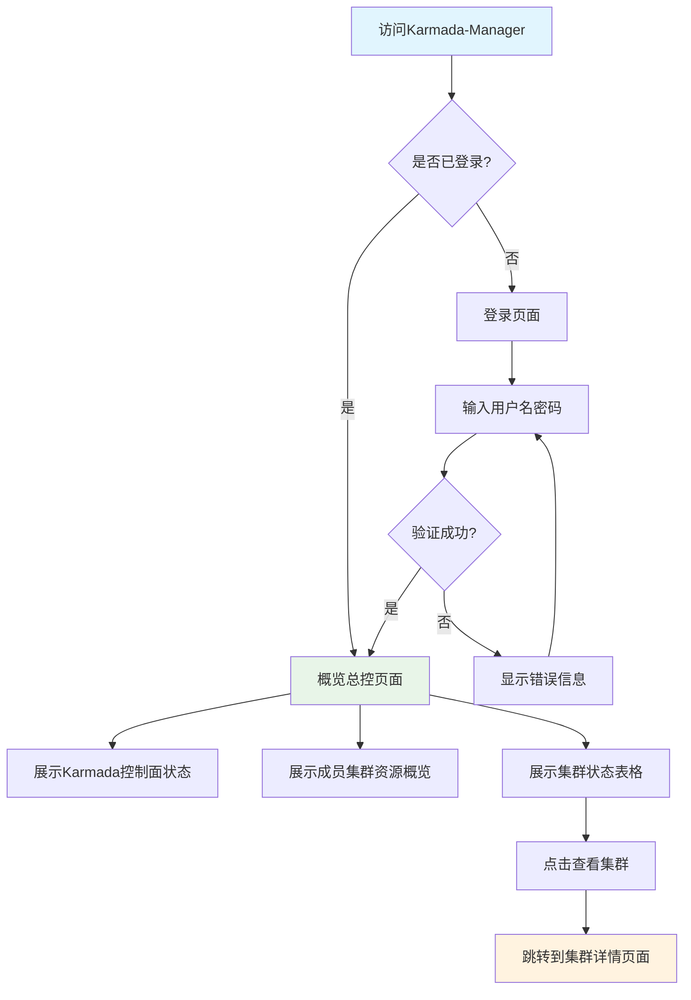
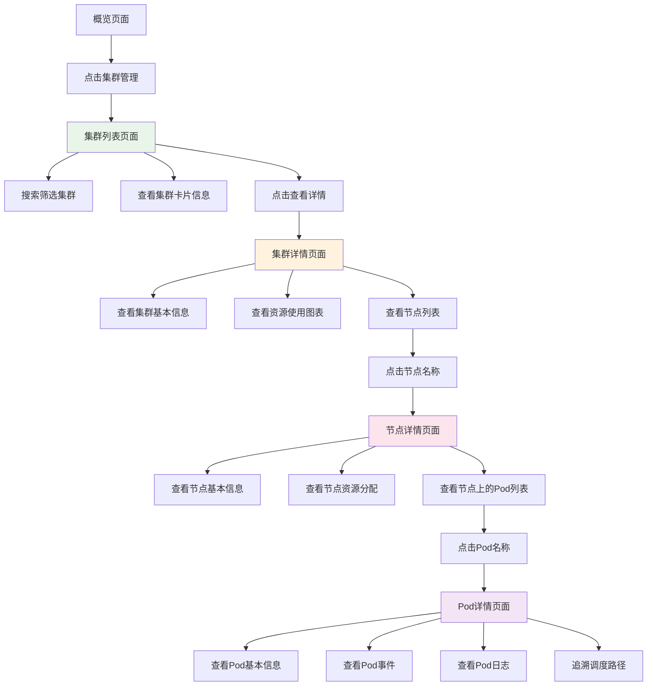
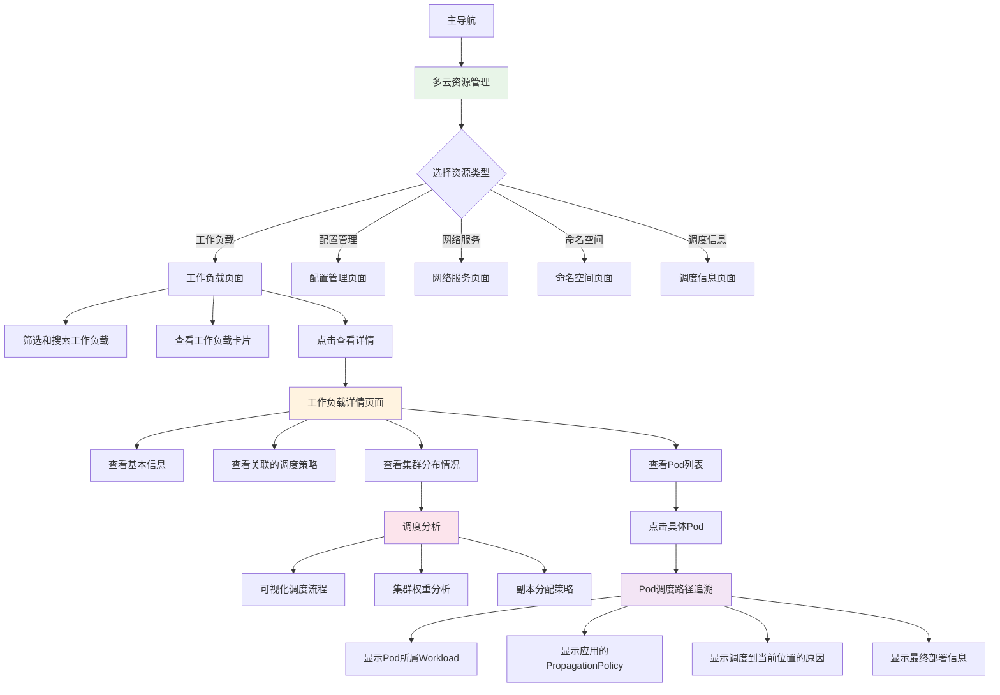
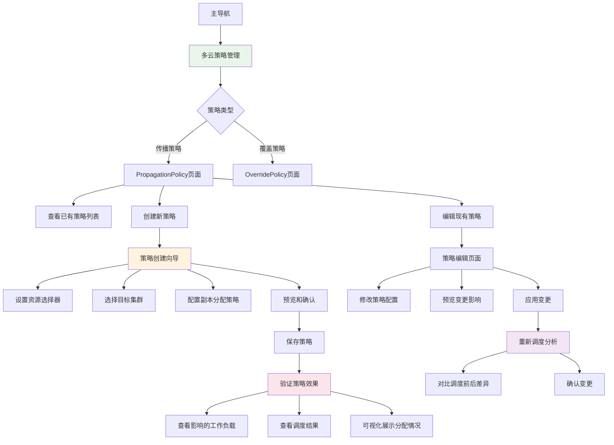
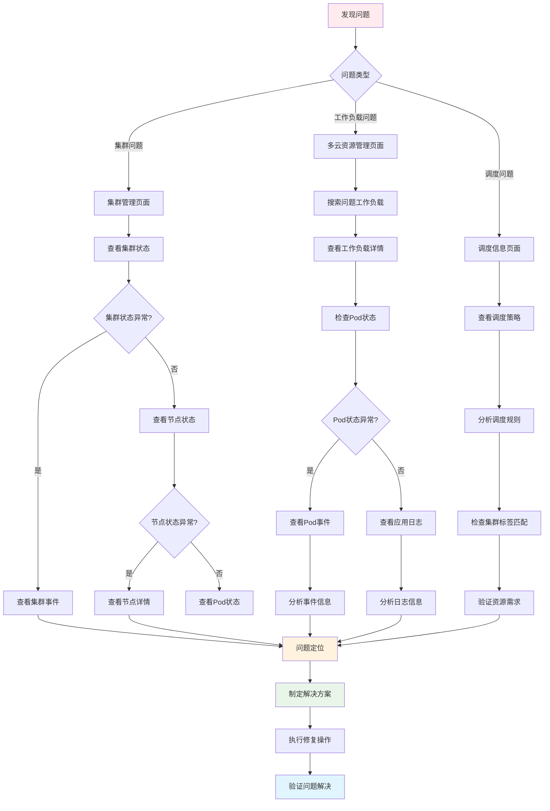
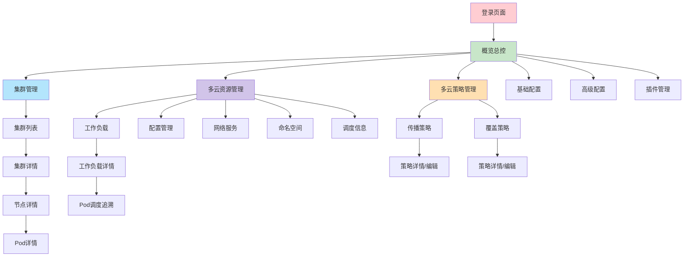
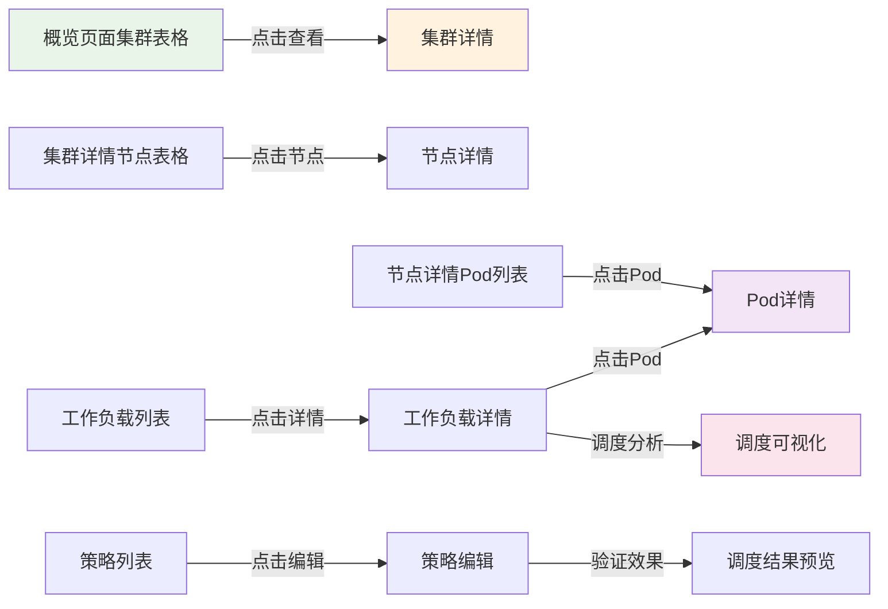

# Karmada-Manager 用户操作流程图

## 1. 文档信息

### 1.1 版本历史

| 版本号 | 日期 | 作者 | 变更说明 |
|--------|------|------|----------|
| 1.0 | 2025-01-XX | 产品设计师 | 初稿创建，用户操作流程设计 |

### 1.2 文档目的

基于用户故事地图和PRD文档，设计Karmada-Manager的用户操作流程图，为前端开发提供清晰的交互逻辑和页面跳转指导。

## 2. 用户角色和目标

### 2.1 主要用户角色
- **平台运维工程师 (张伟)**: 负责多集群管理、监控和故障排查
- **应用开发者 (李娜)**: 关注应用部署和运行状态

### 2.2 核心业务目标
1. 监控集群与资源健康状态
2. 管理成员集群内部资源
3. 配置与验证资源调度策略
4. 追踪应用部署与调度路径
5. 故障诊断与问题定位

## 3. 主要操作流程图

### 3.1 用户登录和系统概览流程

### 3.2 集群管理操作流程

### 3.3 多云资源管理流程

### 3.4 策略管理操作流程

### 3.5 故障诊断操作流程

## 4. 页面间跳转关系图

### 4.1 主要页面层级结构

### 4.2 快速跳转路径

## 5. 用户交互设计要点

### 5.1 导航体验
- **面包屑导航**: 每个子页面都显示当前位置和返回路径
- **侧边栏状态保持**: 用户选择的菜单项状态在页面跳转时保持
- **快速搜索**: 全局搜索功能，支持快速定位资源

### 5.2 数据刷新机制
- **自动刷新**: 关键页面(概览、集群状态)定时自动刷新
- **手动刷新**: 提供手动刷新按钮
- **实时更新**: 重要状态变化时实时推送更新

### 5.3 操作反馈
- **加载状态**: 数据加载时显示骨架屏或加载指示器
- **操作确认**: 重要操作前提供确认对话框
- **结果反馈**: 操作完成后显示成功/失败消息

### 5.4 错误处理
- **友好错误页面**: 404、500等错误的友好提示页面
- **重试机制**: 网络错误时提供重试选项
- **降级体验**: 部分功能不可用时的替代方案

## 6. 响应式交互适配

### 6.1 桌面端交互
- **悬停效果**: 丰富的悬停反馈和提示信息
- **右键菜单**: 支持右键快捷操作
- **键盘快捷键**: 常用操作的快捷键支持

### 6.2 移动端交互
- **触摸友好**: 按钮和链接区域适配触摸操作
- **滑动操作**: 支持左右滑动切换视图
- **简化菜单**: 移动端菜单结构优化

### 6.3 平板端交互
- **混合交互**: 同时支持触摸和鼠标操作
- **侧边栏自适应**: 根据屏幕尺寸自动收起/展开

## 7. 性能优化考虑

### 7.1 页面加载优化
- **懒加载**: 非关键页面和组件懒加载
- **预加载**: 预加载用户可能访问的页面
- **缓存策略**: 合理的数据缓存和过期策略

### 7.2 数据展示优化
- **分页加载**: 大量数据分页或虚拟滚动
- **增量更新**: 只更新变化的数据部分
- **优先级展示**: 重要信息优先加载和展示

## 8. 可访问性考虑

### 8.1 键盘导航
- **Tab顺序**: 逻辑清晰的Tab键导航顺序
- **焦点指示**: 明确的焦点视觉指示
- **快捷键**: 主要功能的键盘快捷键

### 8.2 屏幕阅读器支持
- **语义化标记**: 使用正确的HTML语义标签
- **ARIA标签**: 为复杂组件添加ARIA属性
- **状态通知**: 重要状态变化的语音通知

### 8.3 视觉辅助
- **高对比度**: 支持高对比度主题
- **字体缩放**: 支持字体大小调整
- **色彩独立**: 不仅依赖颜色传达信息

---

*此流程图将根据用户反馈和功能迭代持续优化* 