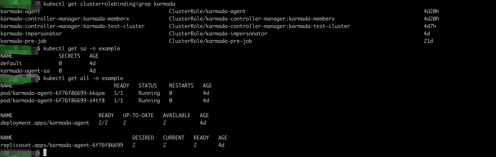
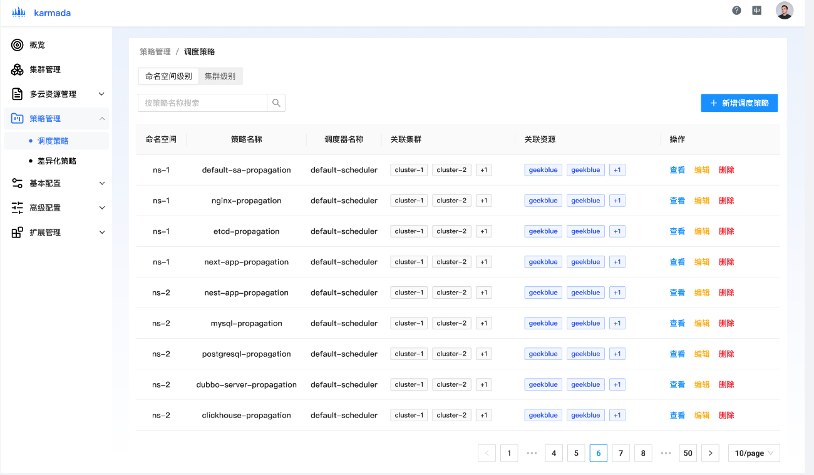

# Overwrite karmada dashboard
This design document is a proposal for overwriting dashboard of Karmada, which will complete some features of Karmada dashboard, like full management of clusters and other core resources in karmada, make the Karmada dashboard under the status of general available.

## Background
Karmada dashboard was written in the stack of `vue.js` and `nginx reverse-proxy`, it currently provide view of clusters、policies of propagation and override, some functions like managing new cluster cannot be easily implemented under the current architecture, for example if we want to manage a worker cluster of `pull` mode, it will need to create some basic resources in worker clusters like `service account`、`clusterrole`、`clusterrolebinding` between the `service account` and the `clusterrole`, along with a `deployment` of `karmada-agent`:

if we implemented all of the stuffs by invoking the api exposed by karmada-apiserver through nginx, it'll be a hard work, also it's unsafe due to the whole process will be hacked if someone wants even if we uglify the javascript code.

## Abstraction / Simplification
After investigating some projects of community, like [kubernetes dashboard](https://github.com/kubernetes/dashboard) and so on, we found that it's a good idea to hide some complex details of some functions in the backend project may be powered by gin、go-restful or other web framework of golang, it can reduce the difficulty obviously by leveraging the ecosystem of kubernetes, like client-go sdk or other tools.

So we want to overwrite the dashboard of karmada under the brand new architecture, which will share the similar architecture of kubernetes dashboard.

# Design
The design will introduce new UX of Karmada dashboard, although it will be more fluent than before, we still should obey the following two rules:
- User First: no matter what new features  introduced, we should take care of the experience of end users.
- Practical First: we should take the habits of our end users into consideration, the UX should be intuitive for users.

## Navigation
Navigation is realized by left hand side menu. Submenus are grouped by the functionality of the corresponding pages. For example, under the menu of `Policy Management` has two submenus: `Propagation Policy Management` and `Override Policy Management`, `Propagation` and `Override` are two sides of `Policy` in Karmada, one for dispatching resources into worker cluster while the other one for patching the resource before the resource be applied into the specific work cluster. Apart from `Policy Management`, `Multi Cloud Resource Management` shares the same concept. Navigation and the corresponed function of the main menu as following:
- Overview: user will have the main view of whole clusters intuitively, like how many clusters are controlled by the control plane of Karmada.
- Multi Cloud Resource Management: this section is used for create resources of Kubernetes in the control plane of Karmada, cover most kinds of resources developer used daily, like namespace、workload(deployment、daemonset、statefulset etc.)、service(kubernetes service、ingress、maybe gateway cross the clusters )、config(sercet along with configmap)
- Policy Management: policy the is the first class citizen in Karmada, under the menu of `Policy Management`, there are two submenus: `Propagation Policy Management` and `Override Policy Management`, for management of policies, we present the part that users care most on the first screen of management, for example, we present matched clusters for propagation policy so that user can quickly know how many clusters are affected by this propagation policy.
- Basic Configuration: this menu consists of configuration of some feature-gates in Karamada and some very pratical configurations like config for helm repo and docker registry, it will be a common config for enterprise scenarios.
- Advanced Configuration: in this part, we want to allow the administrators to config the parameters of failover、policy of reschedule, this will be used not as common as menus above, but also important for enterprise.
- Addon Management: addons can be categoried into two parts, buildin and third-party which maybe co-implemented with the community. Search components、metrics adapater and maybe more addons implemented by the official team of Karmada in the future are buildin addons, some addons are not but essential for minimize installation of Karmada, we want to provide a convenient way for user to install these kind of addons with no pain. In the offcial website of Karmada, there are many usecases of third-party components, these usecases should be freezed as an addon and shared across the community if possible.

## Concrete pages
This section shows more detaied view of the function described in the section of [Navigation](#navigation)
- Overview:
  Overivew page can present statistics across the clusters, uses can get the most intuitive view of the status of whole federation of clusters. 
  

- Cluster Management: 
  Main purpose of `Cluster Management` is managing the worker clusters, including managing new clustes, patch labels、taints of the worker clusters, if worker clusters are deprecated, administrators can remove the worker cluser easily.
  
  List of clusers, users can search for target clusers with keyword of cluser name:
  
  Manage new worker clusters, include mode of basic and advanced:
  
  
  
  Patch labels and taint of clusters, this will be useful for administrators to dispatch resources according label selector.
  
  If some worker clusters are going to down, administrators can remove these clusters in Karmada dashboard which has the same effects as karmadactl.
  

- Multi Cloud Resource Management:
 Multi Cloud Resource Management is used for managing resources of kubernetes, this section will cover most part of resources developers used every day.
 
 Create new namespace, you should be aware of that namespace will be dispatch in default, if you want to avoid these kind of behaviour, you should choose option of 'no':
 
 List of deployments, we also use yaml editor, no extra knowledges, no new grammer:
 
 
 
 In page of detail, we present more info of scheduling, which make it easy to debug the process of scheduling:
 
- Policy Management:
  Propagation and override policy are the first class citizen in Karmada, detail of curd of propagation policy shows following:
  
  
  
  
  Management of override share many similar concept, the difference is the policy editor: 
  
  

- Basic Configuration: 
  Repo of helm and docker are under the spec of OCI, so we put it together:
  
  

# Credits
The origin design file of Karmada dashboard can be visit [here](../images/karmada-dashboard.fig), it's in format of [figma](https://www.figma.com/), you can view it with figma locally, or you can visit it online, follow the [link](https://www.figma.com/file/Bhr3HPgEpdpFJ6bDZyCwGj/karmada-dashboard?type=design&node-id=0%3A1&mode=design&t=YEoDYyUWN8hW2Kje-1)
Proposed by [@a](https://github.com/a).