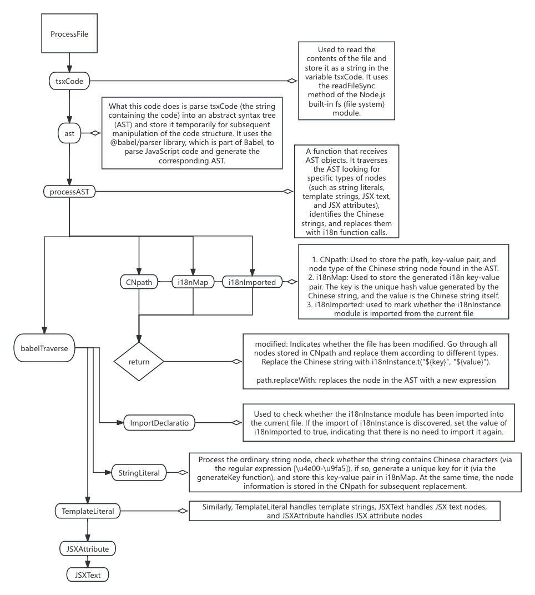
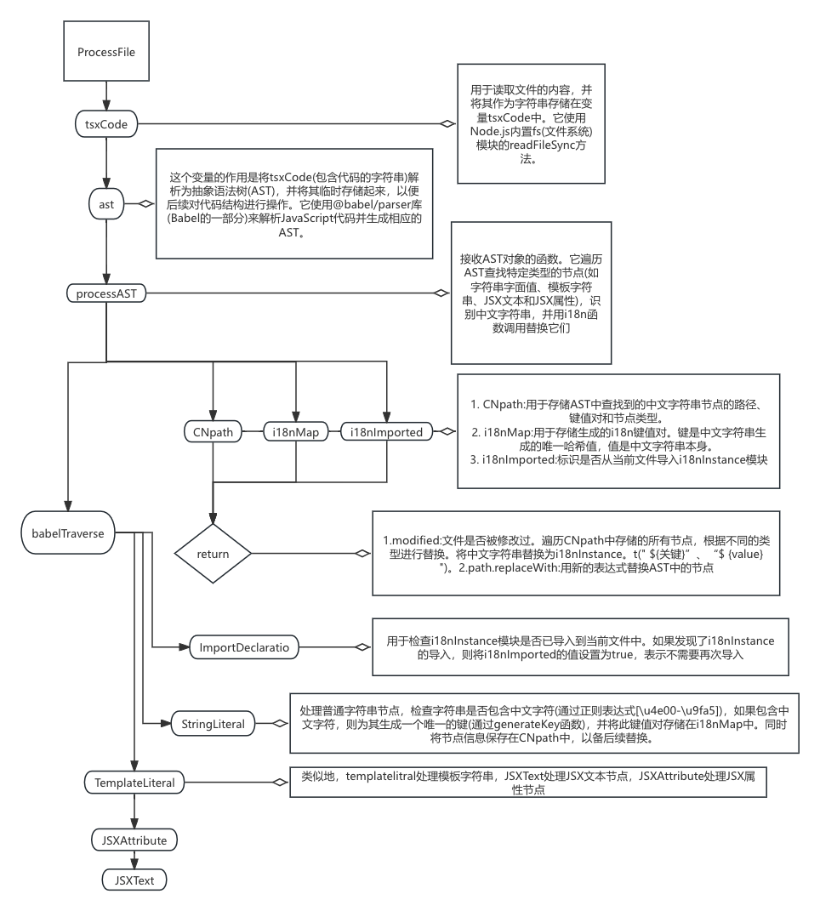
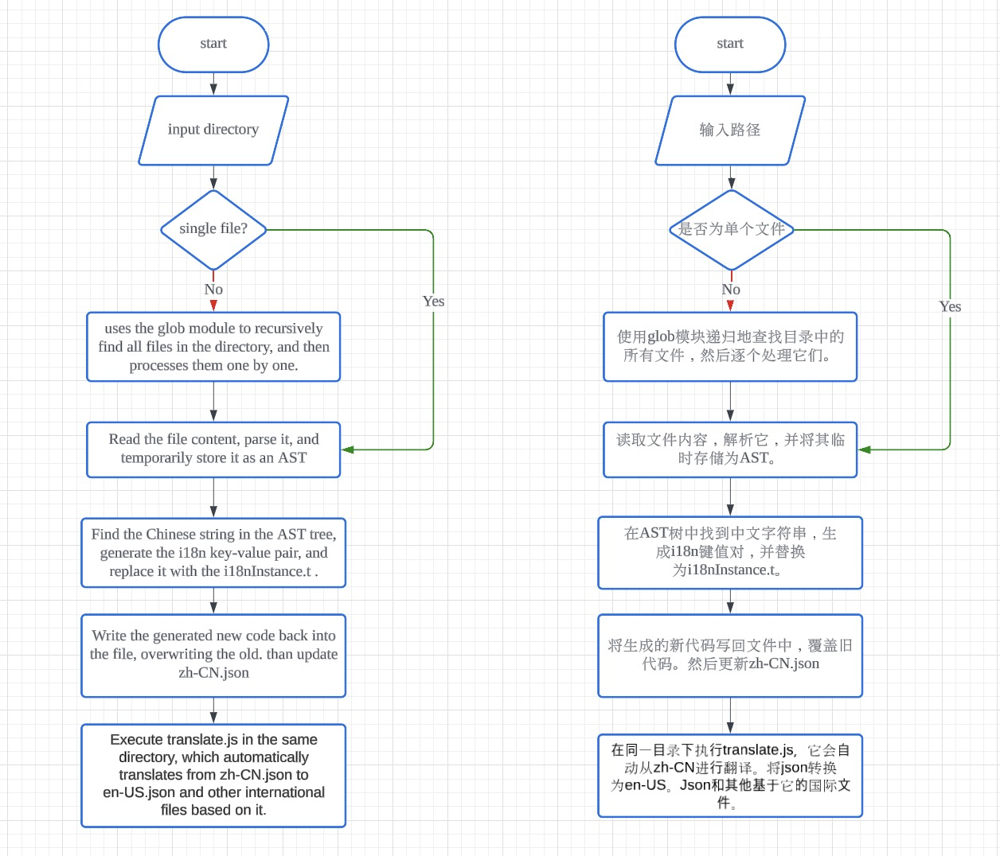

# Automation tools for i18n and translate

## Summary

This is an out-of-the-box automated i18n tool designed for the Karmada dashboard, developed primarily from a Chinese environment perspective. It implements the following features:

1. Automatically configures i18n key-value pairs in the form of {key:value}.
2. Automatically translates all i18n key-value pairs in a directory and adds them to the existing i18n repository.

<!--
这是一个为Karmada dashboard设计的开箱即用的自动化i18n工具，基于以中文环境开发的主视角，它实现了以下功能：
1. 自动配置i18n键值对，并且为{key:value}形式。
2. 自动翻译整个目录下的i18n键值对，并且添加到原有的i18n仓库中。
-->

## Motivation

The global digital landscape demands applications that cater seamlessly to diverse linguistic audiences. Recognizing this need, we embarked on creating an automated tool designed specifically for the Karmada dashboard, which simplifies the process of internationalizing applications by automatically detecting and converting Chinese text within the code into internationalized function calls. This tool not only enhances the accessibility and usability of applications across different language-speaking regions but also streamlines the development process by integrating internationalization early in the software development lifecycle. 
<!--
全球数字环境要求应用程序能够无缝地迎合不同语言的受众。认识到这一需求，我们着手创建一个专门为karma仪表板设计的自动化工具，通过自动检测并将代码中的中文文本转换为国际化的函数调用，简化了国际化应用程序的过程。该工具不仅增强了跨不同语言区域的应用程序的可访问性和可用性，而且还通过在软件开发生命周期的早期集成国际化来简化开发过程。通过自动生成和更新用于国际化的键值对。
-->

### Goals

This tool aims to automatically identify various code nodes, like plain strings and JSX elements, replacing Chinese characters with i18n keys and integrating them into locales/zh-CN.json. It then executes translations based on this file to produce multilingual content in languages such as English.

<!--
该工具旨在自动识别各种代码节点，如普通字符串和JSX元素，用i18n键替换中文字符并将其集成到locale /zh-CN.json中。然后，它基于该文件执行翻译，以生成英语等语言的多语言内容。
-->

### Non-Goals

Developers need to manually add the styles of Chinese characters types that are not already supported by the tool when encountering them.

<!--
开发人员需要在遇到工具不支持的汉字样式时手动添加样式。
-->

## Proposal

1. Automatic Node Identification: Enhance the tool to automatically identify and process various node types within the source code, including plain string nodes, template literal nodes, JSX text nodes, and JSX attribute nodes. This capability will ensure comprehensive scanning and modification of all potential text elements that may require internationalization.

2. Chinese Character Replacement: Implement a robust mechanism to replace all detected Chinese characters within the original files with corresponding i18n keys. This step is crucial for preparing the codebase for multi-language support and ensuring that all textual content is ready for internationalization.

3. Integration with Localization Files: Automate the inclusion of new i18n keys into the locales/zh-CN.json file. This process should handle updates efficiently, ensuring that all keys are accurately reflected in the localization files without manual intervention.

4. Translation Execution: Develop and integrate a translation program that utilizes the updated zh-CN.json file to generate corresponding translations in other languages, such as English (en-US) and French. This functionality will allow for rapid and accurate production of multilingual content.



<!--
1. 自动节点识别:增强工具以自动识别和处理源代码中的各种节点类型，包括纯字符串节点、模板文字节点、JSX文本节点和JSX属性节点。此功能将确保对可能需要国际化的所有潜在文本元素进行全面扫描和修改。

2. 汉字替换:实现一个健壮的机制，用相应的i18n密钥替换原始文件中所有检测到的汉字。这一步对于为多语言支持准备代码库和确保所有文本内容都为国际化做好准备至关重要。

3. 与本地化文件的集成:自动将新的i18n键包含到locale /zh-CN中。json文件。此过程应有效地处理更新，确保所有密钥都准确地反映在本地化文件中，而无需人工干预。

4. 翻译执行:开发和整合使用更新后的zh-CN的翻译程序。json文件生成对应的其他语言的翻译，如英语(en-US)和法语。该功能将允许快速和准确地制作多语言内容。
-->
中文版本：

### User Stories (Optional)

<!--
Detail the things that people will be able to do if this KEP is implemented.
Include as much detail as possible so that people can understand the "how" of
the system. The goal here is to make this feel real for users without getting
bogged down.
-->

#### Story 1
For instance, I named my tool CNfinder. When developers execute ```CNfinder -d <directory_of_files_needing_i18n>``` the tool automatically searches and performs the i18n replacements.

<!--
例如，我给我的工具取名为CNfinder, 在开发者以中文为主语言进行前端开发后，执行 ```CNfinder -d <需要进行i18n的文件目录>``` 后，该工具就能自动检索，并且进行i18n的替换
-->
#### Story 2

### Notes/Constraints/Caveats (Optional)

<!--
What are the caveats to the proposal?
What are some important details that didn't come across above?
Go in to as much detail as necessary here.
This might be a good place to talk about core concepts and how they relate.
-->

### Risks and Mitigations

The i18n tool modifies the original files, potentially causing irreversible changes. Developers need to save a version of the previous generation code before using it.
<!--
i18n工具会修改原始文件，可能导致不可逆的更改。开发人员需要在使用前保存上一代代码的一个版本。
-->

## Design Details

### Modular Design:
1. Function Modularization:

processAST Function: Responsible for processing the AST, identifying and replacing Chinese strings, and generating i18n key-value pairs.
generateKey Function: Generates unique keys for use in the i18n JSON file.
updateZhCNFile Function: Updates the internationalization JSON file by appending new key-value pairs.

2. Main Modules:

File Reading and Parsing: Reads file content and parses it into an AST.
AST Traversal and Processing: Traverses the AST tree, identifying and replacing Chinese strings.
File Writing: Writes the modified code back to the file and updates the internationalization file.
<!--
1.功能模块化:

processAST功能:负责AST的处理，识别和替换中文字符串，生成i18n个键值对。
generateKey函数:生成i18n JSON文件中使用的唯一键。
updateZhCNFile函数:通过附加新的键值对更新国际化JSON文件。

2.主要模块:

文件读取和解析:读取文件内容并将其解析为AST。
AST遍历和处理:遍历AST树，识别和替换中文字符串。
文件写入:将修改后的代码写回文件并更新国际化文件。
-->

### Process Design:
1. File Reading:
Use fs.readFileSync to read file contents, converting them into a string.
2. AST Parsing:
Use babelParser.parse to parse the string code into an AST, specifying the use of jsx and typescript plugins.
3. AST Traversal:
Use babelTraverse to traverse the AST tree, processing different types of nodes (strings, template strings, JSX text, and JSX attributes) and identifying Chinese strings within them.
4. Key Generation:
Use generateKey to generate a unique key for each identified Chinese string, storing it in i18nMap.
5. AST Modification:
Traverse the stored node information, replacing Chinese strings with the internationalization function call i18nInstance.t(key, value).
6. File Writing Back:
Use babelGenerator to generate the modified code and write it back to the file.
Call updateZhCNFile to update the internationalization JSON file, appending the newly generated key-value pairs.



<!--
1. 文件阅读:
使用fs.readFileSync读取文件内容，并将其转换为字符串。
2. AST解析:
使用babelParser.parse将字符串代码解析为AST，指定使用jsx和typescript插件。
3. AST遍历:
使用babelTraverse遍历AST树，处理不同类型的节点(字符串、模板字符串、JSX文本和JSX属性)，并识别其中的中文字符串。
4. 密钥生成:
使用generateKey为每个识别的中文字符串生成一个唯一的键，并将其存储在i18nMap中。
5. AST修改:
遍历存储的节点信息，用国际化函数调用i18nInstance替换中文字符串.t(关键字,值)。
6. 文件回写:
使用babelGenerator生成修改后的代码并将其写回文件。
调用updateZhCNFile更新国际化JSON文件，附加新生成的键值对。
-->


### Test Plan

Rely on vitest for unit testing, details will be given later.

<!--
主要依靠vitest进行单元测试，细节将会在之后给出。
-->

## Alternatives

Recognition of Chinese characters can be achieved through regex tools, but due to the more comprehensive functionality of the Babel package, the Babel ecosystem was chosen.

<!--
中文字符的识别可以通过正则化工具来实现，但是由于bables包的功能更加全面，故选用了bables生态
-->

<!--
Note: This is a simplified version of kubernetes enhancement proposal template.
https://github.com/kubernetes/enhancements/tree/3317d4cb548c396a430d1c1ac6625226018adf6a/keps/NNNN-kep-template
-->