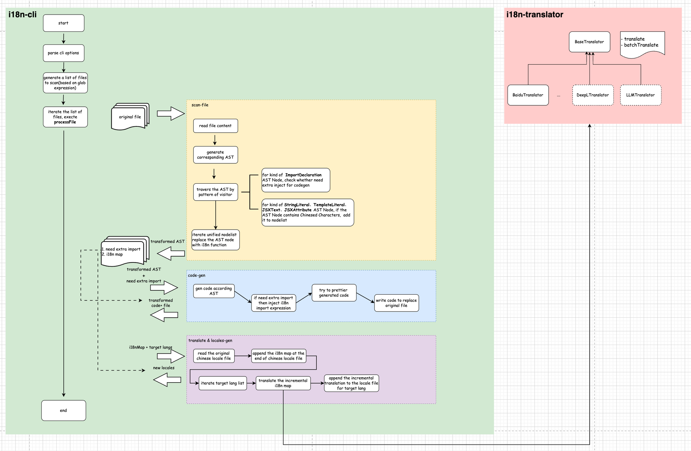

# Automation tools for i18n and translate

## Summary

Internationalization (aka i18n) is essential for software that aims to become global. During the development of the Karmada dashboard, we suffered from low efficiency、 easy to make mistakes、lack of engineering due to maintaining i18n translation (aka locales) manually. To solve these issues and meet the i18n needs of the Karmada dashboard project, we developed an out-of-the-box automated i18n tool.

<!--
国际化(也称为i18n)对于需要全球化的软件来说是必须要的，在开发Karmada dashboard的过程中，我们遇到了手动维护翻译内容(也称为locales文件)效率低、容易出错、多人协作时缺乏工程化的问题，因此我们我们开发了一套开箱即用的i18n自动化工具，解决这些问题，满足Karmada dashboard项目的i18n的需求。
-->

## Motivation

During the development of the Karmada dashboard, we maintained the locales files manually in the early stages. If new Chinese content was added to the code, we need to replace Chinese content with i18n keys and i18n function. After that, a mapping of code points to the corresponding Chinese content was added to the Chinese locales file. Then translating the Chinese content and inserting a mapping of code points to the translated content in the locales files of the respective languages. When the project was small and the amount of Chinese characters was limited, the cost of manual maintenance was relatively acceptable. However, as the project scaled up and the number of Chinese characters increased rapidly, the cost of maintaining locales files in manual way rose exponentially. Therefore, an automated i18n tool was needed to meet the i18n requirements of the Karmada dashboard. In the open source community, it was hard to find an out-of-the-box i18n tool that perfectly supported the i18n needs of the Karmada dashboard. Therefore, we aimed to develop an automated i18n tool which is based on the perspective of the Karmada dashboard's i18n requirements, to satisfy the specific i18n needs of the Karmada dashboard.
<!--
在开发Karmada dashboard的过程中，早期我们是通过人工的方式来维护locales文件，如果代码中新增了中文内容，则需要替换中文内容为对应的码点+i18n的调用函数，之后在中文的locales文件中插入码点和对应的中文内容的映射关系，再翻译中文内容，并在对应的语言的locales文件插入码点和对应翻译后内容的映射关系。在项目规模小，中文字符少的情况下手动维护的成本相对可以接受，但是一旦项目规模逐渐扩大、中文字符变多的情况下，手动维护locales文件的方式的成本会呈指数倍上升，因此需要一套i18n自动化工具来满足Karmada dashboard的i18n需求。在开源社区中我们发现很难找到一套开箱即用的i18n工具能够完美支持Karmada dashboard的i18n需求，因此我们希望从Karmada dashboard的i18n需求出发，实现一套满足Karmada dashboard的i18n需求的i18n自动化工具。
-->

### Goals

1. Extract Chinese characters from the code and automatically replace them with calls to i18n functions
2. Automatically maintain multilingual locales dictionary files.
3. Support integration with third-party translation capabilities to automatically translate Chinese copy into the target language.

<!--
- 从代码中提取中文字符并自动将中文字符替换为i18n函数的调用
- 自动地维护多语言的locales字典文件
- 支持接入第三方翻译能力，自动的将中文文案翻译到目标语言
-->

### Non-Goals

1. Developers need to manually add the styles of Chinese characters types that are not already supported by the tool when encountering them.
2. Character length inconsistency encountered in multilingual display.

<!--
1. 开发人员需要在遇到工具不支持的汉字样式时手动添加样式。
2. 多语言显示过程中遇到的字符长度不一致现象
-->

## Proposal

### User Stories (Optional)

<!--
Detail the things that people will be able to do if this KEP is implemented.
Include as much detail as possible so that people can understand the "how" of
the system. The goal here is to make this feel real for users without getting
bogged down.
-->

#### Story 1
As a developer of the Karmada dashboard, when introducing new features with a significant amount of new Chinese content, there is an automated tool that can extract, translate, and generate corresponding locale files for this new content with a single click, thereby reducing the maintenance cost of i18n. The community administrator provides the corresponding i18n translation rules for specific descriptions. In automatic translation, you can preferentially use the i18n translation rules provided by the community administrator and combine them with automatic translation to improve the overall effect of i18n translation.

<!--
作为Karmada dashboard的项目开发人员，开发新feature的时候在项目中引入了大量的新增中文内容，对于这部分内容希望有一套自动化的工具可以一键完成新增中文内容的提取、翻译并生成对应的locale文件，降低i18n的维护成本。社区管理员对于特定的描述提供对应的i18n翻译规则，自动化翻译的时候可以优先采用社区管理员提供的i18n翻译规则再结合自动化翻译，提高整体i18n翻译的效果。
-->
#### Story 2

### Notes/Constraints/Caveats (Optional)

<!--
What are the caveats to the proposal?
What are some important details that didn't come across above?
Go in to as much detail as necessary here.
This might be a good place to talk about core concepts and how they relate.
-->

### Risks and Mitigations

The i18n tool modifies the original files, potentially causing irreversible changes. Developers need to save a version of the previous generation code before using it.
<!--
i18n工具会修改原始文件，可能导致不可逆的更改。开发人员需要在使用前保存上一代代码的一个版本。
-->

## Design Details
The overall i18n automation tool comprises two main modules: the translation module and the command-line module. The translation module is responsible for interfacing with mainstream translation APIs, and its interface-oriented programming approach ensures good extensibility. If a better translation implementation is invented in the future, it can be integrated by simply supporting the corresponding translation interface. The command-line module serves as the entry point for the entire i18n tool, handling the main workflow of the i18n functionality, which is showed as follows:

<!--
整体i18n自动化工具包含两个主要的模块：翻译模块以及命令行模块，翻译模块负责对接主流翻译API，面相接口的编程方式保证了良好的拓展性，如果未来有更好的翻译实现，只需要支持对应的翻译接口即可接入；命令行模块是整个i18n工具的入口，负责完成i18n功能的主流程，整体如下所示：
-->

### Modular Design:

1. Process AST Function: Responsible for processing the AST, identifying and replacing Chinese strings.
2. Generate i18n key Function: Generates unique keys for use in the i18n JSON file.
3. Update locales files Function: Update Locales files as material for subsequent translation functions.
4. Translate Function: Choose the right way to translate from a variety of options.
<!--
功能模块化:

processAST功能: 负责AST的处理，识别和替换中文字符串.
generateKey功能: 生成i18n JSON文件中使用的唯一键。
updateLocales功能：更新Locales文件，作为后续翻译功能的材料。
translate功能： 从多种选择中挑选合适的方式进行翻译。

-->

### Process Design:
#### Translate Process:
 The overall design adopts an interface-oriented development approach. In BaseTranslator, defining the translation implementation for single statements as well as for batch statements. Specific implementation classes only need to implement the corresponding translation methods. For example, integrating with Baidu's translation services, we have defined BaiduTranslator. After implementing the corresponding interface, one simply needs to instantiate a BaiduTranslator object to use its translation capabilities.

<!--
整体设计上采用面相接口的开发模式，在BaseTranslator 中定义了对单个语句的翻译实现以及批量语句的翻译实现，具体的实现类中只需要实现对应的翻译方法即可，比如对接baidu提供的翻译实现，我们定义了BaiduTranslator,实现对应的接口后，使用时仅需要实例化BaiduTranslator对象即可调用对应的翻译实现
-->

#### Command-line Process:
The program, which is developed based on Node.js's commander module, primarily handles the main workflow which includes parsing command-line arguments, collecting files to be processed based on configuration parameters which use glob expressions, and iterating over all the files to be processed. It sequentially executes scanning, code generation,  translation and locale file generation modules to complete the entire i18n process. The specific internal implementation is as follows:
<!--
基于Node.js的commander模块开发实现的，程序的主流程中主要负责完成命令行参数的解析、根据配置参数通过glob表达式收集需要处理的文件、遍历所有待处理的文件，对待处理的文件执行依次执行扫描、代码生成模块、翻译&生成locale文件模块，完成整个i18n的过程，内部具体实现如下：
-->

1. Scanning Process: The scanning process is responsible for receiving external raw files and returning a processed AST (Abstract Syntax Tree). The internal process is illustrated in the diagram below:

<!--
扫描流程：扫描模块负责接收外部传入的原始文件，返回处理好的AST(Abstract Syntax Tree)树，内部流程如图：
-->
Convert the input files into an AST, traverse the AST to find nodes which containing Chinese characters, calculate the code points corresponding to the Chinese characters and save them in the i18nMap, and save the transformed AST nodes in CNpath. After the first round of scanning finished, continue to traverse CNpath, converting the Chinese characters in the corresponding AST nodes into the form of i18n function calls, and generate a new AST tree to return.
<!--
将输入的文件转换成AST树，遍历AST树找到包含中文字符的AST节点，计算中文字符对应的码点保存在i18nMap中，并将AST节点作统一转换后保存在CNpath中。完成一趟扫描后，继续遍历CNpath，将对应的AST节点中的中文字符转成i18n的函数调用的形式，生成新的AST树返回出去。
-->
2. Code generating process: This process receives the modified AST from the scanning module and converts this modified AST back into the original code. The internal process is as follows:

<!--
代码生成流程：接收扫描模块返回的修改后的AST树，将修改后的AST树转换成原始代码，内部流程如图:
-->
If the original code does not include an import statement for the i18n instance, an appropriate import statement needs to be inserted. This completes the main workflow of code generation. The process of code generation might inadvertently alter statements unrelated to i18n. To address this issue, a prettier process is introduced to style the generated code according to the original coding style, minimizing changes which were introduced by code-gen. Finally, the newly generated code is written back into the original file.
<!--
如果原始代码中没有对i18n实例的导入，则需要插入对应的import语句。到这里已经完成代码生成的主流程，代码生成的过程可能会导致i18n无关的语句在做code-gen的过程中也被修改了，为了解决这个问题，额外引入了prettier流程，将生成后代码按照原始代码风格做一次prettier，最小化code-gen带来的变更，最后将生成好的代码覆盖写入原始文件中。
-->

3. UpdateLocales process: This part receives the i18nMap which returned from the scanning module and updates the locale files by various target languages. The internal process is as follows: 

<!--
更新locale文件流程： 接收扫描模块返回的i18nMap ，更新多种目标语言的locales文件，内部流程如图：
-->
Based on the returned i18nMap, append updates to the Chinese locales file. Traverse through the target languages, and after the translation for each language is completed using the translator module, append the translated content to the respective languages’ locale files, thus automating the update of locale files.
<!--
根据返回i18nMap更新追加写入到中文locales文件中，遍历目标语言，在调用translator模块完成对应语言的翻译后，将翻译好的内容追加写入到对应语言的locales文件中，完成locales文件的自动更新
-->

### Test Plan

plan to implement the unit testing function of the i18n tool with vitest.

<!--
计划采用vitest实现i18n工具的单元测试功能
-->

## Alternatives

In addition to the AST-based approach for implementing the i18n tool, it is also possible to use regular expressions. However, considering code maintainability (extensive use of regular expressions may reduce code readability), stability of functionality (regular expressions may encounter tricky corner cases), and the more comprehensive features of the Babel ecosystem, the AST-based approach has been chosen for implementing the i18n tool.

<!--
实现i18n工具的除了基于AST的技术路线，还可以通过正则表达式的方式实现，但是考虑到代码的可维护性(大量正则可能会导致代码可读性变差)、功能的稳定性(正则可能遇到比较棘手的corner case)以及 babel生态功能更加完善，因此考虑基于AST的技术路线实现i18n工具.
-->

<!--
Note: This is a simplified version of kubernetes enhancement proposal template.
https://github.com/kubernetes/enhancements/tree/3317d4cb548c396a430d1c1ac6625226018adf6a/keps/NNNN-kep-template
-->