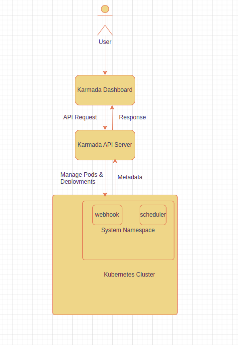
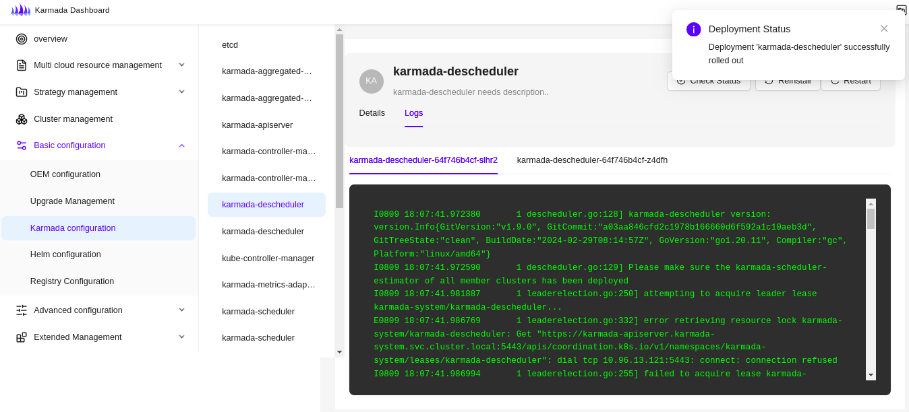
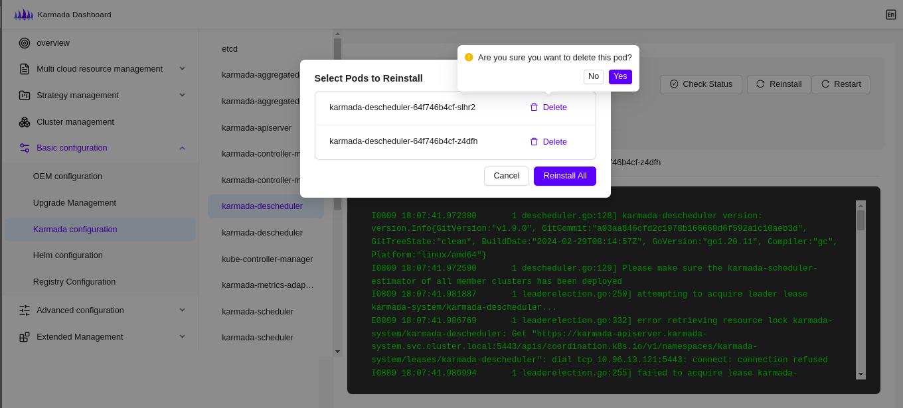
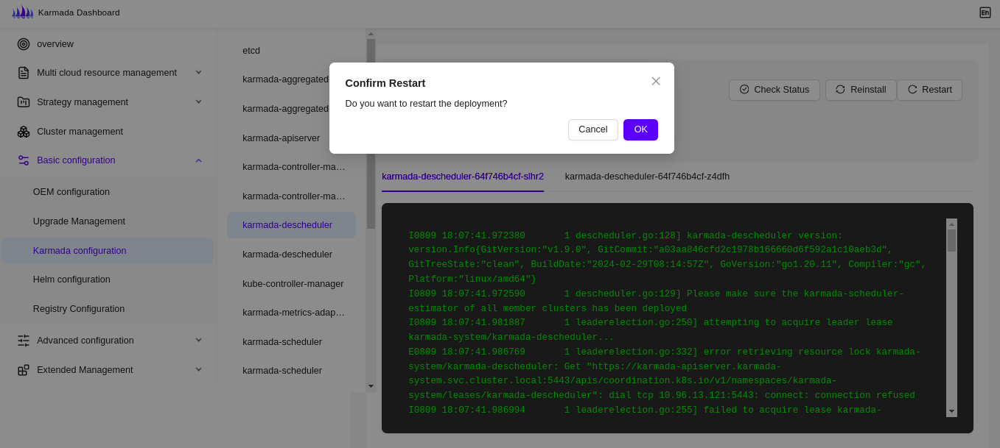
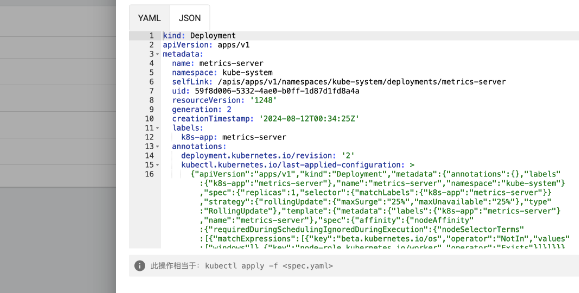

# Configuration of karmada components

<!--
This is the title of your KEP. Keep it short, simple, and descriptive. A good
title can help communicate what the KEP is and should be considered as part of
any review.
-->

## Summary

<!--
This section is incredibly important for producing high-quality, user-focused
documentation such as release notes or a development roadmap. 

A good summary is probably at least a paragraph in length.
-->
To streamline the explanation of Karmada's role in managing multi-cluster Kubernetes environments, Karmada simplifies managing cloud-native applications across multiple Kubernetes clusters and clouds without altering the applications themselves.  

This approach ensures seamless integration with existing Kubernetes tools and avoids vendor lock-in, making it a versatile choice for organizations looking to optimize their Kubernetes deployments across various environments.
## Motivation

<!--
This section is for explicitly listing the motivation, goals, and non-goals of
this KEP.  Describe why the change is important and the benefits to users.
-->
The motivation behind this project seems to be providing an easy-to-use interface for monitoring and managing Kubernetes deployments, specifically tailored for environments where applications are deployed using Karmada, a Kubernetes-native multi-cluster management system. The dashboard simplifies common tasks such as checking deployment health, restarting deployments, viewing pod logs or editing components raw manifest which can be crucial for maintaining the stability and performance of applications running in Kubernetes clusters.


### Goals

<!--
List the specific goals of the KEP. What is it trying to achieve? How will we
know that this has succeeded?
-->

- `Listing Running Applications` which fetches and displays the names of applications currently running in the Kubernetes cluster.
- `Fetching Pod Metadata` where given an app label, it retrieves metadata about the pods associated with that app.
- Allows checking the `status of a specific deployment`, indicating whether it has been fully deployed.
- `Restarting Deployments` provides functionality to restart a given deployment.
- `Deleting Pods` Offers the ability to delete a specific pod.
- `Retrieving Pod Logs` Fetches and displays the logs for a specified pod.
- `edit the components' raw manifest`

### Non-Goals

<!--
What is out of scope for this KEP? Listing non-goals helps to focus discussion
and make progress.
-->

## Proposal

<!--
This is where we get down to the specifics of what the proposal actually is.
This should have enough detail that reviewers can understand exactly what
you're proposing, but should not include things like API designs or
implementation. What is the desired outcome and how do we measure success?.
The "Design Details" section below is for the real
nitty-gritty.
-->

### User Stories (Optional)

<!--
Detail the things that people will be able to do if this KEP is implemented.
Include as much detail as possible so that people can understand the "how" of
the system. The goal here is to make this feel real for users without getting
bogged down.
-->

#### Story 1

Interacting to the systems Architect, dashboard users want to integrate Karmada with existing CI/CD pipelines to automate deployments and updates across multiple clusters. Users can monitor and troubleshoot deployments across clusters from a central dashboard. Also can update the applications. 


### Notes/Constraints/Caveats (Optional)

<!--
What are the caveats to the proposal?
What are some important details that didn't come across above?
Go in to as much detail as necessary here.
This might be a good place to talk about core concepts and how they relate.
-->

### Risks and Mitigations

<!--
What are the risks of this proposal, and how do we mitigate? 

How will security be reviewed, and by whom?

How will UX be reviewed, and by whom?

Consider including folks who also work outside the SIG or subproject.
-->

## Design Details

<!--
This section should contain enough information that the specifics of your
change are understandable. This may include API specs (though not always
required) or even code snippets. If there's any ambiguity about HOW your
proposal will be implemented, this is the place to discuss them.
-->
   
### Karmada Management API

```markdown
This API provides a set of endpoints for managing and monitoring Karmada components in the `karmada-system` namespace. The API translates requests into corresponding Kubernetes commands, enabling automation and integration with other tools or interfaces.
```
### API Endpoints

### 1. Get Running Pods

- **Command**: 
  ```bash
  kubectl --kubeconfig $KUBECONFIG --context karmada-host -n karmada-system get pods -o json
  ```
- **API**: `/config/running-pods`
- **Purpose**: Fetches an overview of all running Karmada components, including metadata such as UID, creation timestamp, name, etc.

### 2. Get Pod Metadata

- **Command**: 
  ```bash
  kubectl --kubeconfig $KUBECONFIG --context karmada-host -n karmada-system get pods -o json
  ```
- **API**: `/config/apps/:appLabel`
- **Purpose**: Provides logs from a specified Karmada pod for debugging or monitoring purposes.

### 3. Fetch Logs

- **Command**: 
  ```bash
  kubectl --kubeconfig $KUBECONFIG --context karmada-host -n karmada-system logs {pod_name}
  ```
- **API**: `/config/log/{pod_name}`
- **Purpose**: Provides logs from a specified Karmada pod for debugging or monitoring purposes.

### 4. Restart Deployment

- **Command**: 
  ```bash
  kubectl --kubeconfig $KUBECONFIG --context karmada-host -n karmada-system rollout restart deployment/{app_name}
  ```
- **API**: `/config/restart/{app_name}`
- **Purpose**: Restarts the specified Karmada component to apply updates or recover from issues.

### 5. Check Deployment Status

- **Command**: 
  ```bash
  kubectl --kubeconfig $KUBECONFIG --context karmada-host -n karmada-system rollout status deployment/{app_name}
  ```
- **API**: `/cluster/status/{app_name}`
- **Purpose**: Monitors the rollout status of a Karmada deployment to ensure it is running correctly.

### 6. Reinstall Pod

- **Command**: 
  ```bash
  kubectl --kubeconfig $KUBECONFIG --context karmada-host -n karmada-system delete pod {pod_name}
  ```
- **API**: `/config/reinstall/{pod_name}`
- **Purpose**: Deletes a specific Karmada pod, which will typically result in its automatic recreation.

## How to Use

Each of the API endpoints corresponds to a specific Kubernetes command used to manage Karmada components. The API can be integrated into your automation tools or used manually via `curl` commands to interact with the Karmada system.

### Example Usage

```bash
# Get running pods
curl http://localhost:8000/api/v1/config/running-pods

curl http://localhost:8000/api/v1/config/apps/karmada-webhook

# Fetch logs of a specific pod
curl http://localhost:8000/api/v1/config/log/karmada-webhook-5cbd5f8f46-ljqjq

# Restart a specific app deployment
curl http://localhost:8000/api/v1/config/restart/karmada-aggregated-apiserver

# Check deployment status
curl http://localhost:8000/api/v1/config/status/karmada-scheduler-estimator-member2

# Reinstall (delete) a specific pod
curl http://localhost:8000/api/v1/config/reinstall/karmada-webhook-5cbd5f8f46-642bg
```


# Frontend Changes

## Check Status & logs




## reinstall


## restart


## Update 




### Test Plan

## Alternatives