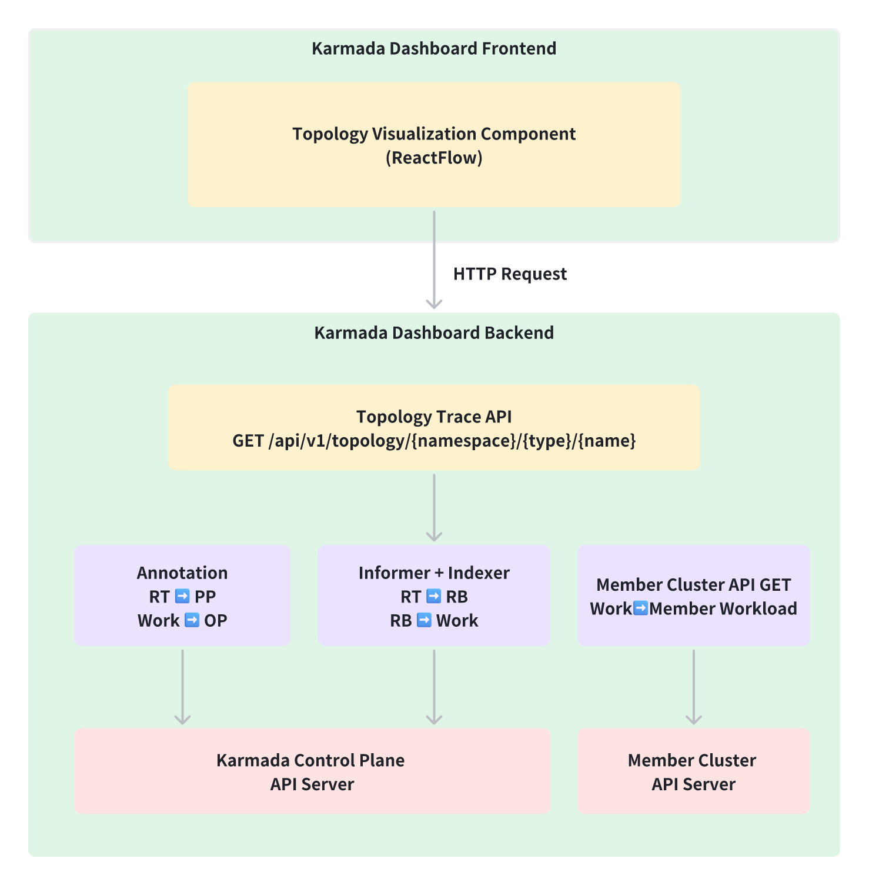
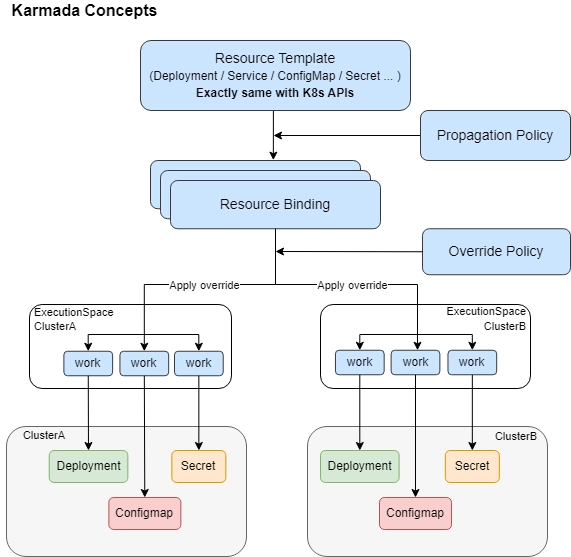
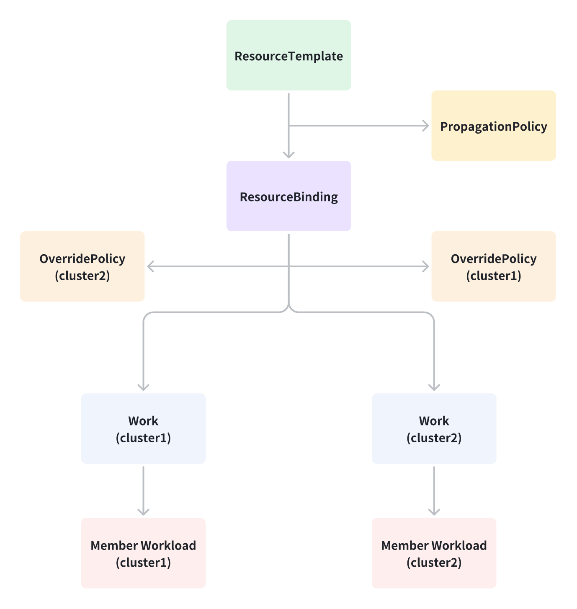

| title | authors   | reviewers | approvers | creation-date |
| --- |-----------| --- | --- |---------------|
| OmniControl for Karmada Dashboard | @SunsetB612 | @ | @ | 2026-03-08    |

# OmniControl for Karmada Dashboard

## Summary

Karmada Dashboard has implemented resource management on both the control plane and member clusters, but resource management remains at the atomic level, with the relationships between resources not yet intuitively presented. Users find it difficult to start from a ResourceTemplate and quickly trace its matching PropagationPolicy, the generated ResourceBindings and Works, and the distribution status across clusters.

OmniControl aims to take ResourceTemplate as the core perspective, integrating and presenting the resource states of both the control plane and member cluster planes, building an end-to-end topology view that covers the full lifecycle of resources. Users can intuitively see the complete chain from policy matching and binding generation to cross-cluster distribution, enabling rapid problem identification when propagation or distribution failures occur.

To this end, we will design and implement topology visualization capabilities for Karmada's core resources, and provide comprehensive design documentation and API documentation.

## Motivation

When managing multi-cluster resources with Karmada Dashboard, users often need to navigate back and forth across multiple pages just to piece together the complete state of a single resource. For example, when a ResourceTemplate encounters a distribution anomaly, users must visit several resource pages separately — including PropagationPolicy, ResourceBinding, and Work — to troubleshoot the issue one by one. This process is tedious and prone to missing critical information.

The current atomic management approach fails to intuitively present the relationships between resources. Users can neither see the matching and binding chain of resources on the control plane, nor get an overview of the distribution and runtime status of a resource across member clusters. This makes fault diagnosis costly, and the difficulty is especially pronounced for users new to Karmada, who struggle to understand the end-to-end flow logic of resources.

Therefore, we aim to introduce OmniControl capabilities into Karmada Dashboard — using ResourceTemplate as the entry point to unify the visualization of related resource associations and cross-cluster states. This will help users quickly grasp the full picture of their resources and reduce the cognitive and operational overhead of multi-cluster management.

### Goals

- Design and implement a resource topology visualization API that supports querying, starting from a ResourceTemplate, its associated PropagationPolicy, ResourceBinding, Work, and the distribution status across member clusters
- Integrate topology visualization components into the Karmada Dashboard frontend to intuitively display resource associations between the control plane and member cluster planes
- Provide comprehensive design documentation and API documentation

### Non-Goals

- The existing atomic resource management pages will not be replaced or modified; OmniControl serves as an enhanced view layered on top of existing capabilities
- No modifications to Karmada's control plane scheduling logic or policy engine are involved

## Proposal

### User Stories (Optional)

### Story 1 — Enhanced Resource Management Experience

As a Karmada user, managing multi-cluster resources currently requires navigating between separate pages for PropagationPolicy, ResourceBinding, Work, and member cluster workloads. This fragmented workflow makes it difficult to understand how resources are connected and increases the time needed for routine operations.

With OmniControl, users can start from any Workload and instantly see its full propagation topology in a single view — the matched PropagationPolicy, generated ResourceBindings, distributed Works, and the actual workloads running in each member cluster. Users can click any node in the topology to inspect or operate on that resource directly, without switching between pages. This unified view reduces cognitive overhead, simplifies daily resource management, and makes the Karmada Dashboard more intuitive for both new and experienced users.

### Story 2 — Fault Diagnosis

As a cluster administrator, when a Workload is not running as expected in a member cluster, the current troubleshooting process requires manually checking each stage of the propagation chain — PropagationPolicy matching, ResourceBinding generation, Work dispatch, and member cluster execution — across different pages and namespaces, making it easy to lose context or miss the root cause.

With OmniControl, the administrator can open the topology view for the problematic Workload and immediately identify the failing stage through status coloring (green/yellow/red). Clicking the abnormal node reveals its detailed status, events, and conditions without leaving the topology view, significantly reducing the mean time to diagnosis.

### Notes/Constraints/Caveats (Optional)

### Risks and Mitigations

## Design Details

### Overview

The overall overview is illustrated in the diagram below:



### Resource Propagation Chain (Informer + Indexer)

**Core Idea**: Use SharedInformerFactory to build a local cache and register custom Indexers for O(1) lookups, minimizing API server pressure.

The complete propagation chain from control plane to member clusters:

```
ResourceTemplate (control-plane)
  → PropagationPolicy / ClusterPropagationPolicy
    → ResourceBinding / ClusterResourceBinding
      → OverridePolicy / ClusterOverridePolicy (applied on Work)
        → Work (in namespace karmada-es-{cluster})
          → Workload (member cluster)
```

#### Workload ➡️ PropagationPolicy

Locate the associated PropagationPolicy by reading two annotations from the Workload:
- `propagationpolicy.karmada.io/namespace`: The namespace where the PropagationPolicy is located
- `propagationpolicy.karmada.io/name`: The name of the PropagationPolicy

Once these values are obtained, perform a direct GET to retrieve the PropagationPolicy resource.

#### Workload ➡️ ResourceBinding

Use a ResourceBinding Informer with a custom Indexer keyed by `ownerReferences[].uid`:

1. Start the ResourceBinding Informer to cache all ResourceBinding objects locally
2. Register a custom Indexer with `ownerReferences[].uid` as the index key
3. The Informer automatically maintains an `ownerUID → []ResourceBinding` index in memory
4. At query time, use the Workload's `uid` as the key to retrieve matching ResourceBindings in O(1)

```go
rbs, err := rbInformer.GetIndexer().ByIndex("byOwnerUID", string(deploy.UID))
```

#### ResourceBinding ➡️ Work

Use a Work Informer with a custom Indexer keyed by annotation `resourcebinding.karmada.io/name`:

1. Start the Work Informer to sync and cache all Work objects locally
2. Register a custom Indexer with `metadata.annotations["resourcebinding.karmada.io/name"]` as the index key
3. The Informer automatically maintains an `rbName → []Work` index in memory
4. At query time, use the ResourceBinding's name as the key to retrieve matching Works in O(1)

```go
workItems, err := workInformer.GetIndexer().ByIndex("byRBName", rbName)
```

#### Work ➡️ OverridePolicy

Retrieve applied overrides by reading Work annotations:
- **Namespace-level**: `policy.karmada.io/applied-overrides` — OverridePolicies from the same namespace
- **Cluster-level**: `policy.karmada.io/applied-cluster-overrides` — ClusterOverridePolicies

Each annotation contains a JSON array of applied policies. Use the `policyName` field to locate the actual OverridePolicy/ClusterOverridePolicy resource.

#### Work ➡️ Member Workload

Retrieve the actual workload from the member cluster:
1. From the Cluster CR, obtain the cluster's API endpoint and authentication credentials (secret)
2. Build a Kubernetes client using these credentials
3. Perform a GET request to retrieve the workload (Deployment, Pod, etc.) from the member cluster

### Frontend Topology Visualization

The frontend uses the topology rendering engine ReactFlow to render the link data returned by the backend into an interactive Directed Acyclic Graph (DAG), with node levels arranged from top to bottom:

<table width="100%">
<tr>
<td width="50%"></td>
<td width="50%"></td>
</tr>
</table>

Interaction Design:
* **Entry Point:** Add a "Topology View" icon button to each row of the existing resource list page; clicking it opens the full-chain topology view for that resource.
* **Node Click:** Clicking any node in the topology graph displays the detailed information of that resource.
* **Status Coloring:** Nodes are colored according to resource status (green = healthy, yellow = in progress, red = abnormal), helping users quickly locate faulty nodes.
* **Auto Layout:** The topology graph uses automatic layout algorithms such as Dagre to ensure that nodes do not overlap and connections remain clear in multi-cluster scenarios.

### Test Plan

## Alternatives

### Solution 1: Annotation-Based Forward Tracing

**Core Idea**: Starting from a control-plane Workload, trace downstream resources by following Karmada's injected annotations and ownerReferences to discover associated PropagationPolicies, ResourceBindings, Works, and their distribution across clusters.

#### Workload ➡️ PropagationPolicy

Same as the proposed solution.

#### Workload ➡️ ResourceBinding

List all ResourceBindings in the same namespace as the Workload, then filter by comparing the ownerReferences:
- Check if any ResourceBinding's `ownerReferences[].uid` matches the Workload's `uid`
- A matching ResourceBinding indicates it was created to manage this specific Workload

Multiple ResourceBindings may be created if the Workload matches multiple PropagationPolicies.

#### ResourceBinding ➡️ Work

For each cluster specified in the ResourceBinding's `spec.clusters`:
1. Construct the namespace: `karmada-es-{ClusterName}`
2. List all Works in that namespace
3. Filter by annotation: `resourcebinding.karmada.io/name` equals the ResourceBinding's name

This returns the Work object that represents the Workload's deployment to that specific cluster.

#### Work ➡️ OverridePolicy

Same as the proposed solution.

#### Work ➡️ Member Workload

Same as the proposed solution.

### Solution 2: Direct GET via Naming Convention

**Core Idea**: Karmada uses deterministic naming rules for ResourceBinding and Work, allowing direct GET queries by constructing names instead of using List operations.

**Naming Rules**:
- **ResourceBindingName**: `WorkloadName + "-" + WorkloadKind`
- **WorkNamespace**: `"karmada-es-" + ClusterName`
- **WorkName**: `ResourceBindingNamespace + "-" + ResourceBindingName + "-" + hash`

#### Workload ➡️ PropagationPolicy

Same as the proposed solution.

#### Workload ➡️ ResourceBinding

Use the deterministic naming convention to directly construct the ResourceBindingName and perform a GET query, avoiding List operations.

```go
rbName := names.GenerateBindingName("Deployment", name)
rb, err := clients.KarmadaClient.WorkV1alpha2().ResourceBindings(namespace).Get(ctx, rbName, v1.GetOptions{})
```

#### ResourceBinding ➡️ Work

Retrieve all cluster information from the ResourceBinding, construct the deterministic WorkName for each cluster, and perform GET queries.

```go
// Query ClusterName from ResourceBinding
for _, binding := range rb.Spec.Clusters {
    clusterName := binding.Name

    // Construct Work namespace
    workNamespace := "karmada-es-" + clusterName

    // Construct Work name
    workName := names.GenerateWorkName("Deployment", name, namespace)

    // Direct GET Work
    work, err := clients.KarmadaClient.WorkV1alpha1().Works(workNamespace).Get(ctx, workName, v1.GetOptions{})
}
```

#### Work ➡️ OverridePolicy

Same as the proposed solution.

#### Work ➡️ Member Workload

Same as the proposed solution.

### Comparison of Three Solutions

**Lookup Method per Step**:

| Step | Proposed (Informer + Indexer) | Solution 1 (Annotation-Based Tracing) | Solution 2 (Naming Convention GET) |
|------|-------------------------------|----------------------------------------|------------------------------------|
| RT → PP | Annotation direct GET | Annotation direct GET | Annotation direct GET |
| RT → RB | Informer Indexer by `ownerReferences[].uid`, O(1) | List all RBs, filter by `ownerReferences[].uid` | Construct name via `GenerateBindingName`, direct GET |
| RB → Work | Informer Indexer by annotation `resourcebinding.karmada.io/name`, O(1) | List Works in `karmada-es-{cluster}`, filter by annotation | Construct name via `GenerateWorkName`, direct GET |
| Work → OP | Annotation direct GET | Annotation direct GET | Annotation direct GET |
| Work → Member Workload | Member cluster client GET | Member cluster client GET | Member cluster client GET |

**Overall Comparison**:

| Aspect | Proposed (Informer + Indexer) | Solution 1 (Annotation-Based Tracing) | Solution 2 (Naming Convention GET) |
|--------|-------------------------------|----------------------------------------|------------------------------------|
| Performance | Best — O(1) in-memory lookup | Worst — multiple List + filter | Good — direct GET, still requires API calls |
| Startup Cost | High — requires Watch to build local cache | None | None |
| Memory Usage | High — maintains full resource cache | Low | Low |
| Reliability | High — based on Kubernetes native mechanisms | High — works with any naming pattern | Low — breaks if naming rules change |
