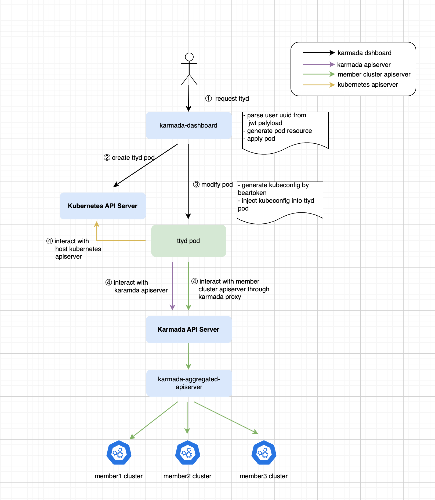
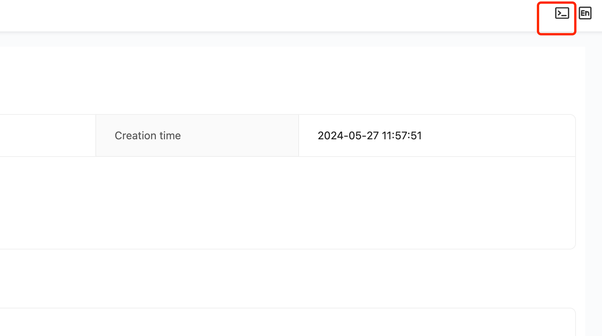
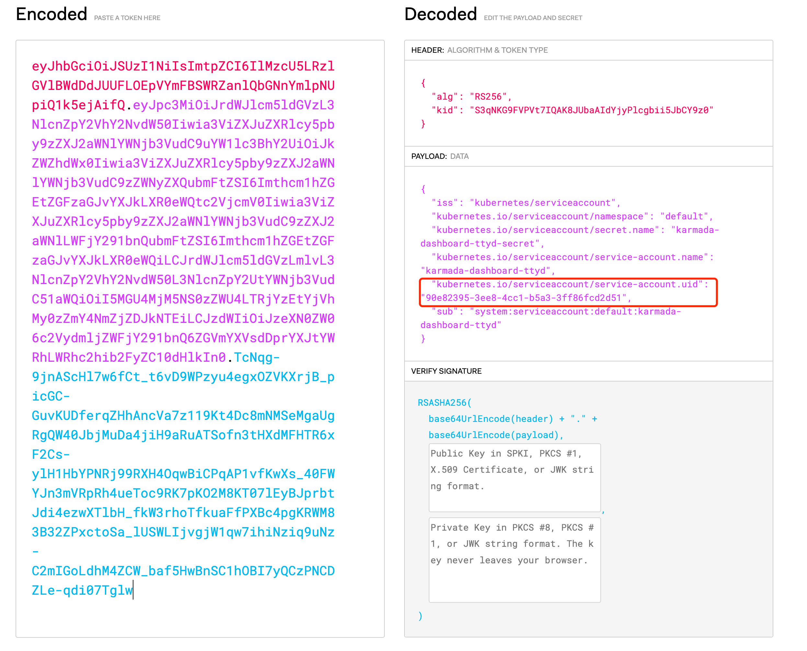

| title | authors   | reviewers | approvers | creation-date |
| --- |-----------| --- | --- | --- |
| Web-terminal for Karmada Dashboard | @warjiang | @ | @ | 2024-07-08 |

# Web-terminal for Karmada Dashboard

## Summary

Web-terminal is a tool that allows you to execute command-line  through web ui. [`ttyd`](https://github.com/tsl0922/ttyd) is an implementation of a web-terminal where user input commands on the web page are sent to `ttyd's` backend via the WebSocket protocol. The backend executes the commands and returns the results of the command line execution to the user.

[`karmadactl`](https://karmada.io/docs/reference/karmadactl/karmadactl-commands/karmadactl/) is the official command-line tool supported by Karmada, offering a lot of useful functionalities for Karmada.

We aim to integrate ttyd with karmadactl by customizing the web-terminal, which will provide fundamental executable files like kubectl 、karmadactl and configured environment. This integration will provide users with an out-of-box Karmada execution environment and offer a web-terminal entry point on the Karmada dashboard.

## Motivation

While the Karmada team provides lots of documentation on their official website, users may still encounter several issues when getting started with karmada. Common challenges include **confusion between Karmada and Kubernetes kubeconfig configuration files** and **network connectivity issues during cluster registration and join commands**. Additionally, **the functionality of the Karmada dashboard is not as comprehensive as karmadactl**.

To address these challenges, we want to provide a web-terminal entry point on the Karmada dashboard. This entry point will inject common tools like karmadactl and kubectl into the web-terminal container, offering users an out-of-box Karmada experience directly from the dashboard.

### Goals

- Provide an API to allow users to attach to a container and execute commands.
- Create and modify web-terminal containers through an API (supporting private registry, allowing customization of web-terminal image).
- Provide a web-terminal UI component to allow users to use the web-terminal component on the frontend.
- Make use of the above components and backend api in the Karmada dashboard, expose the web-terminal to allow users to operate Karmada resources.

### Non-Goals

## Proposal

### User Stories (Optional)

### Story 1

**As a new user, after referencing the official Karmada documentation to launch the minimal experience cluster with Kind, users may encounter several issues while experiencing the Karmada environment,** such as**:**

- Confusing Karmada and Kubernetes kubeconfig configuration files, difficulty in distinguishing the context within the kubeconfig.

  [https://github.com/karmada-io/karmada/issues/4641](https://github.com/karmada-io/karmada/issues/4641)

  [https://github.com/karmada-io/karmada/issues/4120](https://github.com/karmada-io/karmada/issues/4120)

- Users who have installed Helm cannot access the available karmada.config configuration file.

  [https://github.com/karmada-io/karmada/issues/4013](https://github.com/karmada-io/karmada/issues/4013)


The issues mentioned above are mostly due to environment, and containers can provide a standardized, uniform operating environment. Therefore, we aim to offer a customized container that pre-installs binary files such as kubectl and karmadactl, while also initializing the relevant kubeconfig and certificate files for users. This will provide new users with a standard experience of the Karmada environment.

### Story 2

As system administrator, they hope to have a comprehensive dashboard experience capability. **The current development progress of the dashboard lags far behind the main Karmada repository.** Many features accumulated from the practices of a large number of users will take quite a long time to catch up with the functionality of the main repository. Even if the functionalities are aligned in the future, there may still be a possibility that the UI development progress may not keep up with the main repository, such as with karmadactl. Therefore, we need to provide a mechanism to ensure that features not yet implemented in the UI can be downgraded in some form for system administrators, ensuring the integrity and coherence of operations.

### Notes/Constraints/Caveats (Optional)

### Risks and Mitigations

## Design Details

The overall overview is as shown in the following diagram:



**The process of creating web-terminal**：

1. When users click on the terminal icon on the page, it calls the `/api/v1/misc/terminal` API to create a web terminal.”

   

2. After receiving the request, the Karmada dashboard will create a unique ttyd container for the current user.
    1. Parsing the payload section of the JWT token to obtain the UUID of the current user：

       

    2. Generate a unique pod resource based on the UUID. The YAML representation of the pod is as follows:：

        ```yaml
        apiVersion: v1
        kind: Pod
        metadata:
          name: ttyd-4ac87008-3426-4cae-8f3c-141e03a0e34b
          namespace: karmada-system
        spec:
          containers:
          - image: ***registry****/tsl0922/ttyd:1.7.4-dev-v1
            imagePullPolicy: IfNotPresent
            livenessProbe:
              failureThreshold: 3
              initialDelaySeconds: 5
              periodSeconds: 10
              successThreshold: 1
              tcpSocket:
                port: 7681
              timeoutSeconds: 1
            name: ttyd-4ac87008-3426-4cae-8f3c-141e03a0e34b
            ports:
            - containerPort: 7681
              name: tcp
              protocol: TCP
            readinessProbe:
              failureThreshold: 3
              initialDelaySeconds: 5
              periodSeconds: 10
              successThreshold: 1
              tcpSocket:
                port: 7681
              timeoutSeconds: 1
            volumeMounts:
            - mountPath: /var/run/secrets/kubernetes.io/serviceaccount
              name: kube-api-access-qqjwf
              readOnly: true
          dnsPolicy: ClusterFirst
          enableServiceLinks: true
          imagePullSecrets:
          - name: ***
          restartPolicy: Always
          volumes:
          - name: kube-api-access-qqjwf
            projected:
              defaultMode: 420
              sources:
              - serviceAccountToken:
                  expirationSeconds: 3607
                  path: token
              - configMap:
                  items:
                  - key: ca.crt
                    path: ca.crt
                  name: kube-root-ca.crt
              - downwardAPI:
                  items:
                  - fieldRef:
                      apiVersion: v1
                      fieldPath: metadata.namespace
                    path: namespace
        ```

    3. Wait for the generated ttyd pod which is created in the previous step to be in a ready state.
    4. Generate the corresponding kubeconfig for the current logged-in user and inject it into the pod. An example of a kubeconfig is as follows:

        ```yaml
        apiVersion: v1
        kind: Config
        clusters:
        - name: karmada-apiserver
          cluster:
            server: https://172.18.0.2:5443
            insecure-skip-tls-verify: true
        users:
        - name: karmada-apiserver
          user:
            token: ***token***
        contexts:
        - name: karmada-apiserver
          context:
            cluster: karmada-apiserver
            user: karmada-apiserver
        current-context: karmada-apiserver
        ```

3. When the frontend invokes the`/misc/pod/:namespace/:pod/shell/:container` request, the backend will generate a session ID and start a go routine in the background. It maintains a connection to the web-terminal container through client-go and maps the session ID to the web-terminal connection in memory.
4. After receiving the session ID, the frontend calls `/api/v1/misc/sockjs/info?&t={timestamp}` to obtain http CORS header .
5. The frontend calls `/api/v1/misc/sockjs/654/zngjnkpm/websocket?{sessionid}` to upgrade the HTTP protocol to the WebSocket protocol. After the connection is established, it sends…

    ```json
    {"Op":"bind","SessionID":"da39bfc51bf42e3a945de73c9c9fc09d"}
    ```

   After receiving the bind command, the backend searches in memory for the link corresponding to the session ID of the web terminal. If the link exists, it establishes the connection between the frontend and the web terminal; otherwise, it throws an exception.


### Test Plan

## Alternatives