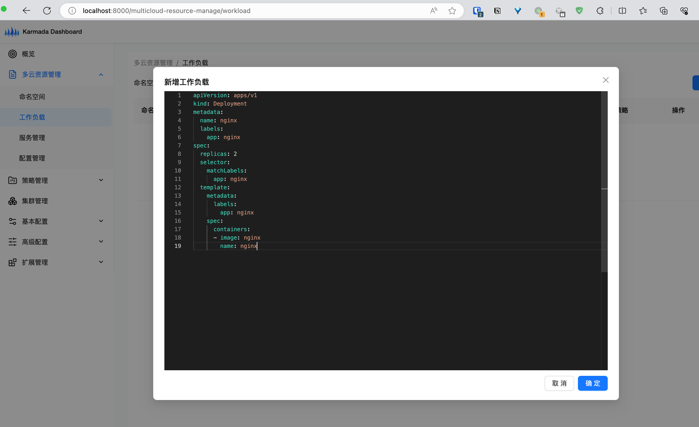

# Preparation
## Setup System Environment
Before installation, make sure that [docker](https://www.docker.com/), [kind](https://kind.sigs.k8s.io/docs/user/quick-start/), [kubectl](https://kubernetes.io/docs/reference/kubectl/), [karmadactl](https://karmada.io/docs/next/reference/karmadactl/karmadactl-usage-conventions/), [cfssl and cfssljson ](https://cfssl.org/) are correctly installed on your machine. Prior to execution, the following configurations need to be applied to the host machine:：
```shell
# https://serverfault.com/questions/1137211/failed-to-create-fsnotify-watcher-too-many-open-files
sudo sysctl -w fs.inotify.max_user_watches=2099999999
sudo sysctl -w fs.inotify.max_user_instances=2099999999
sudo sysctl -w fs.inotify.max_queued_events=2099999999
```


## Create Cluster For Test
Once the system environment is set up, you can proceed with installing the test cluster. The test cluster consists of a control plane and three member clusters. The control plane will have the karmada control plane installed, while the member clusters include two push mode member clusters and one pull mode member cluster.
The architecture of the test cluster is as follows:


Run the following command to load images into the local docker space:

```shell
cp hack/images/image.list.load.online.example hack/images/image.list.load.online
bash hack/ops/load-images.sh hack/images/image.list.load.online
```

Run the following command to start the test cluster:

```shell
bash hack/local-up-karmada.sh
```


# Installation of karmada-dashboard
The karmada-dashboard will reuse the kubeconfig secret resource of the karmada control plane. Execute the following commands for installation:

```shell
export KUBECONFIG=${HOME}/.kube/karmada.config
kubectl config use-context karmada-host

kubectl apply -f artifacts/dashboard/karmada-dashboard-sa.yaml
kubectl apply -f artifacts/dashboard/karmada-dashboard-api.yaml
kubectl apply -f artifacts/dashboard/karmada-dashboard-web.yaml
kubectl apply -f artifacts/dashboard/karmada-dashboard-configmap.yaml
```


Create a service account resource and obtain the corresponding JWT token for logging into the dashboard:
```shell
export KUBECONFIG=${HOME}/.kube/karmada.config
kubectl config use-context karmada-apiserver
kubectl apply -f artifacts/dashboard/karmada-dashboard-sa.yaml
kubectl -n karmada-system get secret/karmada-dashboard-secret -ojsonpath='{.data.token}' | base64 -d && echo
```

After logging in, you can see the provided overview information:


# Usage of karmada-dashboard
Here, we will use the karmada-dashboard to complete [the quickstart tutorial](https://karmada.io/docs/get-started/nginx-example) of the karmada documentation.

Firstly, create a workload under Multi-Cloud Resources/Workloads. Since the workload is placed under the `default` namespace, there is no need to create an additional namespace here.


Once the workload is created, create a propagation policy for this workload.


At this point, the karmada control plane will distribute the workload resources to the corresponding member clusters based on the propagation policy. Returning to the page of workloads, you can view detailed event information for the workload resource.


The nginx workload has been distributed to member1 and member2 clusters except member3 cluster.


